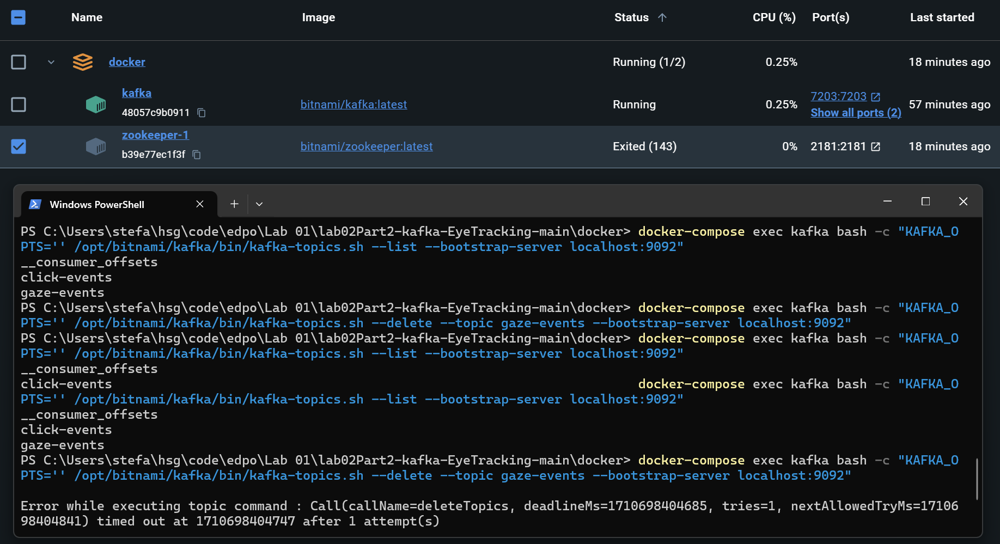

# University of St.Gallen - Exercise Submission

## Course Information

- **Course:** Event-driven and Process-oriented Architectures FS2024
- **Instructors:** B. Weber, R. Seiger, A. Abbad-Andaloussi

## Deadline

- **Submission Date:** 05.03.2024; 23:59
- **[Work distribution](https://github.com/luetzyas/edpo-ss24-drop-shipping-a1-gr4/blob/master/docs/submissions/change_log.md)**

# E01 - Outage of Zookeeper

## E01-01: During Runtime

### Parameters and Process

- **Lab:** 02 Part2 Eye-tracking main.
- **Action:** Run the lab as provided and then shut down the Docker Container of Zookeeper.

### Observations
- Both Producer and Consumer continue running as before.
- While running both Kafka and Zookeeper, the 'ConsumerForGazeEventsForEyeTrackerPartitionsRebalancing1' while running alone will consume gaze-events from partition 0 and 1. When starting 'ConsumerForGazeEventsForEyeTrackerPartitionsRebalancing2' it will take over the consumption of gaze-events from partition 1 while the 'Consumer..1' will take over the consumption of gaze-events from partition 0.
- starting the 'Consumer..1' first --> Consume both partitions, Kafka log:
  `  2024-03-17 18:19:07 [2024-03-17 17:19:07,932] INFO [GroupCoordinator 1001]: Stabilized group grp1 generation 5 (__consumer_offsets-48) with 1 members (kafka.coordinator.group.GroupCoordinator)
  2024-03-17 18:19:07 [2024-03-17 17:19:07,941] INFO [GroupCoordinator 1001]: Assignment received from leader consumer-grp1-1-6a7ece98-b46a-454b-b6c8-1c8924394739 for group grp1 for generation 5. The group has 1 members, 0 of which are static. (kafka.coordinator.group.GroupCoordinator)
  `
- starting the 'Consumer..2' first --> now each Consumer consumes one partition, Kafka log:
  `    2024-03-17 18:35:06 [2024-03-17 17:35:06,412] INFO [GroupCoordinator 1001]: Preparing to rebalance group grp1 in state PreparingRebalance with old generation 13 (__consumer_offsets-48) (reason: Adding new member consumer-grp1-1-0f9c477f-157b-4328-8f40-679b535209b1 with group instance id None; client reason: rebalance failed due to MemberIdRequiredException) (kafka.coordinator.group.GroupCoordinator)
  2024-03-17 18:35:06 [2024-03-17 17:35:06,423] INFO [GroupCoordinator 1001]: Stabilized group grp1 generation 14 (__consumer_offsets-48) with 2 members (kafka.coordinator.group.GroupCoordinator)
  2024-03-17 18:35:06 [2024-03-17 17:35:06,426] INFO [GroupCoordinator 1001]: Assignment received from leader consumer-grp1-1-b9580b44-12d4-455a-ab06-7927604b5ff5 for group grp1 for generation 14. The group has 2 members, 0 of which are static. (kafka.coordinator.group.GroupCoordinator)
  `
- stopping one of the Consumers -> finished consuming the assigned partition, then consumes the other partition from commited offset, surviving Consumer log:
  `    [main] INFO org.apache.kafka.clients.consumer.internals.ConsumerCoordinator - [Consumer clientId=consumer-grp1-1, groupId=grp1] Setting offset for partition gaze-events-0 to the committed offset FetchPosition{offset=10479, offsetEpoch=Optional[0], currentLeader=LeaderAndEpoch{leader=Optional[localhost:9092 (id: 1001 rack: null)], epoch=0}}
  [main] INFO org.apache.kafka.clients.consumer.internals.ConsumerCoordinator - [Consumer clientId=consumer-grp1-1, groupId=grp1] Setting offset for partition gaze-events-1 to the committed offset FetchPosition{offset=8134, offsetEpoch=Optional[0], currentLeader=LeaderAndEpoch{leader=Optional[localhost:9092 (id: 1001 rack: null)], epoch=0}}
  `

- Trying to do the same but taking out Zookeeper once both Consumers are working on a partition --> surviving Consumer was able to finish both partitions as before.

- Trying to do the same but taking out Zookeeper once one Consumer is working on both partitions -> also worked

- Kafka Container can't be started when the 'depends on: - zookeeper' is removed from the docker-compose file.
  `  2024-03-17 19:10:06 [2024-03-17 18:10:06,354] INFO shutting down (kafka.server.KafkaServer)
  2024-03-17 19:10:06 [2024-03-17 18:10:06,358] INFO App info kafka.server for -1 unregistered (org.apache.kafka.common.utils.AppInfoParser)
  2024-03-17 19:10:06 [2024-03-17 18:10:06,358] INFO shut down completed (kafka.server.KafkaServer)
  2024-03-17 19:10:06 [2024-03-17 18:10:06,358] ERROR Exiting Kafka due to fatal exception during startup. (kafka.Kafka$)
  2024-03-17 19:10:06 kafka.zookeeper.ZooKeeperClientTimeoutException: Timed out waiting for connection while in state: CONNECTING
  2024-03-17 19:10:06     at kafka.zookeeper.ZooKeeperClient.$anonfun$waitUntilConnected$3(ZooKeeperClient.scala:258)
  2024-03-17 19:10:06     at kafka.zookeeper.ZooKeeperClient.waitUntilConnected(ZooKeeperClient.scala:254)
  2024-03-17 19:10:06     at kafka.zookeeper.ZooKeeperClient.<init>(ZooKeeperClient.scala:116)
  2024-03-17 19:10:06     at kafka.zk.KafkaZkClient$.apply(KafkaZkClient.scala:2266)
  2024-03-17 19:10:06     at kafka.zk.KafkaZkClient$.createZkClient(KafkaZkClient.scala:2358)
  2024-03-17 19:10:06     at kafka.server.KafkaServer.initZkClient(KafkaServer.scala:717)
  2024-03-17 19:10:06     at kafka.server.KafkaServer.startup(KafkaServer.scala:226)
  2024-03-17 19:10:06     at kafka.Kafka$.main(Kafka.scala:112)
  2024-03-17 19:10:06     at kafka.Kafka.main(Kafka.scala)
  2024-03-17 19:10:06 [2024-03-17 18:10:06,360] INFO shutting down (kafka.server.KafkaServer)`


### Conclusion
- Zookeeper is primarily responsible for broker registration, leader election, partition-lists and metadata. When a broker starts, it registers itself in Zookeeper. When producers and consumers connect to the cluster, they use Zookeeper to discover the brokers and the leader for each partition.
  - Producers send messages to the Kafka brokers. They interact with the brokers to determine which partition and therefore which broker they should send messages to based on the topic. The partitioning decision can be influenced by a key or round-robin if no key is provided.
  - Consumers fetch messages from the brokers. They subscribe to topics and pull messages from the brokers. Consumers keep track of their offset (position) in each partition to manage which messages they have processed.
  - Each Kafka broker manages the storage of messages in a partitioned and replicated manner across the cluster. When a producer sends a message to a broker, the broker appends the message to the appropriate partition log. This log is a simple, ordered, and immutable sequence of messages that is stored on disk.
  - Replication is managed among the brokers to ensure fault tolerance. Each partition has one leader and zero or more follower replicas. The leader handles all read and write requests for the partition, while the followers replicate the leader's log. Followers pull messages from the leader to stay in sync.
- Therefore, **shutting Zookeeper down after the broker is already registered and a leader is set for the partitions, it doesn't affect the producer-consumer set-up from the lab**.
- **Producers and Consumers do not interact with Zookeeper directly. They only communicate with the Kafka brokers**. The brokers handle appending messages to logs, replication, and serving consumer requests. This process can continue even if Zookeeper temporarily loses connectivity, as long as the existing cluster state does not change (e.g., no new brokers, no re-elections needed). But operations such as adding a new broker or a new topic, would need Zookeeper.

- With Zookeeper down it's not possible to modfiy topics (e.g. delete) as the partition metadata is stored in Zookeeper. See below screenshot where command to delete a topic is issued but not executed.
 


- The Kafka Broker relies on Zookeeper for discovery and coordination of the Kafka cluster.
  - Brokers register themselves with Zookeeper, which allows them to be discovered by producers, consumers, and other brokers.
  - Zookeeper stores metadata about topics, such as the number of partitions, replication factors, and other configuration details.
  - It helps in leader election for partitions and keeps track of the status of nodes. It also notifies Kafka about any changes within the cluster, like adding or removing nodes.


## E01-02: Before Runtime

### Parameters and Process

- **Lab:** 02 Part2 Eye-tracking main.
- **Action:** Shut down the Docker Container of Zookeeper, then run the lab as provided.

### Observations

#### Producers
- creating topic: click-events
- `[kafka-admin-client-thread | adminclient-1] INFO org.apache.kafka.clients.NetworkClient - [AdminClient clientId=adminclient-1] Disconnecting from node 1001 due to request timeout.`
- `Cancelled createTopics request with correlation id 4 due to node 1001 being disconnected`
- Exited the program 
- Similar for both producers

#### Consumer

- Loaded the last state if records where present in Kafka from previous runs.
- `[main] INFO org.apache.kafka.clients.consumer.KafkaConsumer - [Consumer clientId=consumer-grp1-1, groupId=grp1] Subscribed to topic(s): gaze-events, click-events`
  - Subscription to topics seems to be successful since Kafka Container is up and subscription is possible.
- `Id=grp1] Error while fetching metadata with correlation id 34524 : {gaze-events=UNKNOWN_TOPIC_OR_PARTITION, click-events=UNKNOWN_TOPIC_OR_PARTITION}`
  - Continuously fails within the While-loop to poll for records
- Program keeps running.


#### Kafka
- Kafka Container Logs:
  - `2024-03-02 14:01:47 [2024-03-02 13:01:47,928] WARN [Controller id=1001, targetBrokerId=1001] Connection to node 1001 (localhost/127.0.0.1:9092) could not be established. Broker may not be available. (org.apache.kafka.clients.NetworkClient)`
  - `2024-03-02 14:01:47 java.io.IOException: Connection to localhost:9092 (id: 1001 rack: null) failed.
    2024-03-02 14:01:47     at org.apache.kafka.clients.NetworkClientUtils.awaitReady(NetworkClientUtils.java:70)
    2024-03-02 14:01:47     at kafka.controller.RequestSendThread.brokerReady(ControllerChannelManager.scala:298)
    2024-03-02 14:01:47     at kafka.controller.RequestSendThread.doWork(ControllerChannelManager.scala:251)
    2024-03-02 14:01:47     at org.apache.kafka.server.util.ShutdownableThread.run(ShutdownableThread.java:130)
    2024-03-02 14:01:47 [2024-03-02 13:01:47,932] DEBUG [PartitionStateMachine controllerId=1001] Started partition state machine with initial state -> Map() (kafka.controller.ZkPartitionStateMachine)`


### Conclusion

- The observations indicate that shutting down Zookeeper before running the system affects the connectivity and functionality of the producers and consumer, highlighting Zookeeper's critical role in initial system setup and maintenance. Zookeeper serves in managing the Kafka cluster, including broker health checks, leader election, and maintaining overall cluster stability.
- The Kafka Container Logs indicate that the system is unable to establish a connection with the broker, which is a direct result of Zookeeper being down.
- Topics were created previously


# E02 - Impact of Load and Batch Size on Processing Latency

### Parameters and Process

- **Lab:** 02 Part2 Eye-tracking main.
- **Action:** Adjust the batch size and linger in the clickStream-producer configuration: 
  - batch.size 
    - default is 16384 bytes (16KB)
    - set it to batch.size=65536 bytes (64KB)
  - linger.ms
    - set linger.ms=60000 (1 minute)

- Measure the latency by capturing the time when the record is sent and when the acknowledgment is received. Adding below code snippets to the ClicksProducer and EyeTrackerProducer.
```java
        List<Long> latencyList = new ArrayList<>();
        // ...
        long sendTimeNano = System.nanoTime(); // Capture send time
        // send the click event
        Future<RecordMetadata> future = producer.send(new ProducerRecord<String, Clicks>(
        topic, // topic
        clickEvent  // value
        ));

        RecordMetadata metadata = future.get(); // Blocks until the record is acknowledged
        long ackTimeNano = System.nanoTime(); // Capture ack time
        // Calculate and print the latency in milliseconds
        long latencyInMillis = (ackTimeNano - sendTimeNano) / 1_000_000;
        System.out.println("Latency: " + latencyInMillis + " ms");
        latencyList.add(latencyInMillis);
        //...
        if(counter == 100)
        break;
        // ...
        double averageLatency = latencyList.stream().mapToLong(Long::longValue).average().orElse(0);
        System.out.println("Average latency: " + averageLatency + " ms");
```

### Observations

#### EyeTrackersProducer

##### Baseline with default batch size of 16KB
- `...`
- `gazeEvent sent: eventID: 4997, timestamp: 1350418648235600, xPosition: 892, yPosition: 811, pupilSize: 3,  from deviceID: 0`
- `Latency: 3 ms`
- `gazeEvent sent: eventID: 4998, timestamp: 1350418658812100, xPosition: 748, yPosition: 884, pupilSize: 3,  from deviceID: 1`
- `Latency: 2 ms`
- `gazeEvent sent: eventID: 4999, timestamp: 1350418670381200, xPosition: 1482, yPosition: 1038, pupilSize: 3,  from deviceID: 0`
- **Average latency: 2.3608 ms**

##### With batch size of 64KB
- **Average latency: 2.282 ms**
- **Average latency: 2.3622 ms**

##### With batch size of 1KB
- **Average latency: 2.6022 ms**
- **Average latency: 2.3792 ms**

#### ClickStreamProducer

##### Baseline with default batch size of 16KB
- `...`
- `clickEvent sent: eventID: 97, timestamp: 1350611618473000, xPosition: 418, yPosition: 121, clickedElement: EL1,`
- `Latency: 3 ms`
- `clickEvent sent: eventID: 98, timestamp: 1350614728184900, xPosition: 1172, yPosition: 24, clickedElement: EL8,`
- `Latency: 6 ms`
- `clickEvent sent: eventID: 99, timestamp: 1350616888767700, xPosition: 681, yPosition: 686, clickedElement: EL11,`
- **Average latency: 5.49 ms**

##### With batch size of 64KB
- **Average latency: 5.47 ms**

##### With batch size of 1KB
- **Average latency: 6.32 ms**

##### With batch size of 64KB and linger.ms=1000
- **latency per record: 1003 ms - 1020 ms** 
- Average latency: must be around 1010 ms, we did not wait for the average to be printed after 5000 records. Which would take 83 minutes.

### Conclusion
- batch.size
  - controls the maximum amount of data the producer will batch in memory per partition before sending it to the broker.
  - A larger batch.size allows more messages to be batched together. This can increase throughput (because of reduced requests to the broker) but at the cost of potentially higher latency (as messages wait in the batch to be sent out).
  - A smaller batch.size means batches are sent more frequently with fewer messages, potentially reducing latency (as messages spend less time waiting in the batch) but possibly decreasing throughput (because of the increased number of requests to the broker).


- linger.ms
  - specifies the maximum time to buffer data in memory per partition to reach the batch size before sending it out.
  - A higher linger.ms value allows the producer to wait longer in hopes of sending larger batches, which can improve throughput but increase latency because messages are delayed up to linger.ms milliseconds to form a bigger batch.
  - A lower linger.ms means the producer sends messages as soon as possible, even if the batch is not full, which can reduce latency at the expense of throughput because of the overhead of sending smaller batches.


- Large batch.size and High linger.ms:
  - maximizes the potential for high throughput by sending large batches less frequently.
  - Increased latency due to both messages waiting to fill up the large batch size and the willingness to wait.
  - High throughput is achieved by reducing the number of send operations.


- Large batch.size and Low linger.ms:
  - If the batch fills up quickly, it's sent immediately; otherwise, it sends whatever it has
  - Moderate latency because while batches can be large, the producer won't wait long to send data. Throughput can still be high, especially under high load where the batch size is reached quickly.


- Small batch.size and High linger.ms:
  - producer will send small batches but is willing to wait to fill them as much as possible.
  - Potentially low latency under light loads (since batches are small and can be sent quickly), but under heavier loads, there could be unnecessary latency due to linger.ms, even when the small batch size is quickly reached.


- Small batch.size and Low linger.ms:
  - producer sends messages as soon as possible, without much waiting to fill up the batch
  - The lowest latency since messages are sent immediately after being produced or after a very short wait, but at the cost of lower throughput due to the overhead of sending many small batches.


- Trade-offs between throughput and latency have to be considered, 'it depends' on the use-case.


# E03 - Setup of prometheus and grafana

## Actions
Given the experiments require to keep track of metrics such as latency and throughput, we decided to investigate dedicated monitoring tools.
Research on the topic led to Grafana and Prometheus as popular and for our purposes freely available tools.
The setup of both tools was done using Docker containers:
````yaml
prometheus:
  image: prom/prometheus
  volumes:
  - ./prometheus.yml:/etc/prometheus/prometheus.yml
  - prometheus_data:/prometheus # Persistent volume for Prometheus data
  ports:
  - "9090:9090"
  depends_on:
  - kafka

grafana:
  image: grafana/grafana
  volumes:
  - grafana_data:/var/lib/grafana # Persistent volume for Grafana data
  ports:
  - "3000:3000"
  depends_on:
  - prometheus

volumes:
  prometheus_data:
  grafana_data:
````

The Mbeans of Kafka and Zookeeper were then exposed to Prometheus by mounting the JMX exporter jar into the Kafka and Zookeeper containers. 
This required the following changes to the Kafka and Zookeeper containers:
````yaml
KAFKA_OPTS: "-javaagent:/opt/bitnami/kafka/jmx_prometheus_javaagent-0.20.0.jar=7203:/opt/bitnami/kafka/config.yml"
volumes:
  - ./jmx_prometheus_javaagent-0.20.0.jar:/opt/bitnami/kafka/jmx_prometheus_javaagent-0.20.0.jar
  - ./config.yml:/opt/bitnami/kafka/config.yml
````

## Observations
A Grafana dashboard can be created to visualize the metrics. This however requires quite some effort to set up.
Pre-built dashboards are available but the metrics need to be mapped to the correct labels.
Lastly, interpreting the metrics and understanding the labels can be challenging.


# E04 The risk of data loss due to offset misconfigurations

## E04-01: Read from 0

### Parameters and Process
- **Lab:** 02 Part2 Eye-tracking main.
- **Action:** Adjust the consumer to read from offset 0 and run the lab as provided.

### Observations
- The consumer reads all records from the beginning of the topic, including records that were sent before the consumer was started.

### Conclusion
- The consumer can read records from the beginning of the topic, which can lead to duplicate processing of records if not handled properly. 
This can become a problem if the application is not designed to handle duplicates. Which could cause data to be corrupted, inconsistent, ot incorrect. 
- Specifically, if the consumer is set to read from the earliest offset (auto.offset.reset=earliest), and the consumer restarts or a new consumer joins the consumer group, it will begin reading from the earliest message in the log that is available on the broker. In practical terms, this means the consumer will process all messages from the start of the topic, which includes messages that may have already been processed prior to the restart.

## E04-02: Read from 200

### Parameters and Process
- **Lab:** 02 Part2 Eye-tracking main.
- **Action:** Adjust the consumer to read from offset 200 and run the lab as provided.

### Observations
- The consumer reads all records from offset 200. As the offset starts from 0, the consumer reads the 201st record in the topic.

### Conclusion
- The consumer can read records from the specified offset, which can lead to not processing records that were sent before the consumer was started.
- Manually specifying the offset can lead to a situation where the consumer does not read all records if done incorrectly.
- Kafka however will keep the records for a certain amount of time, so the consumer can still read the records if the offset is set to a value that is lower than the current offset.

## E04-03: Disable auto commit

### Parameters and Process
- **Lab:** 02 Part2 Eye-tracking main.
- **Action:** Adjust the consumer properties to `enable.auto.commit=false` and keep `auto.offset.reset=earliest` and run the lab as provided.

### Observations
- The consumer reads the records from the last committed offset and continues from there.

`[main] INFO org.apache.kafka.clients.consumer.internals.AbstractFetch - [Consumer clientId=consumer-grp1-1, groupId=grp1] Fetch position FetchPosition{offset=100, offsetEpoch=Optional.empty, currentLeader=LeaderAndEpoch{leader=Optional[localhost:9092 (id: 1001 rack: null)], epoch=0}} is out of range for partition click-events-0, resetting offset`

`[main] INFO org.apache.kafka.clients.consumer.internals.SubscriptionState - [Consumer clientId=consumer-grp1-1, groupId=grp1] Resetting offset for partition click-events-0 to position FetchPosition{offset=0, offsetEpoch=Optional.empty, currentLeader=LeaderAndEpoch{leader=Optional[localhost:9092 (id: 1001 rack: null)], epoch=0}}.`

`Received click-events - value: {eventID=0, timestamp=7530686035600, xPosition=970, yPosition=513, clickedElement=EL17}`
- stopped consumer at eventID: 20
- started consumer again -> Starts at eventID: 0

### Conclusion
- Offset always starts from 0 so additional configuration like `enable.auto.commit=false` has no effect.

## E04-04: Disable auto commit

### Parameters and Process
- **Lab:** 02 Part2 Eye-tracking main.
- **Action:** Adjust the consumer properties to `enable.auto.commit=false` and **remove** `auto.offset.reset=earliest` and run the lab as provided.

### Observations
- The Consumer started at the offset where at the point of running it the producer was approximately at with the last record sent. At around eventID=11
- Stopped the Consumer at eventID=27 (Producer)
- Restarted the Consumer at eventID=48 (Producer)
- Consumer started at eventID=48 
- Let both the Consumer and the Producer run until the Producer reached eventID=100 and a few more.
- Stopped the Consumer at eventID=106 (Consumer)
- Restarted the Consumer at eventID=116 (Producer)
- Consumer started at eventID=100
- Stopped and Rerun the Consumer between eventID=258 and eventID=267 -> Consumer started at eventID=100

### Conclusion
- It seems that if the Consumer is not committing the offset automatically at the last processed record, it will start at the last sent record (from the Producer) when restarted. No reprocessing of previous records is done.
- After 101 records were sent, the Consumer started at eventID=100 when restarted, even though the last sent record was higher than that.
- This indicates that after 101 records were sent, the offset was committed as eventID=100.

## E04-05: Disable auto commit and auto offset store

### Parameters and Process
- **Lab:** 02 Part2 Eye-tracking main.
- **Action:** Adjust the consumer properties to `enable.auto.commit=false` and remove `auto.offset.reset=earliest` and `enable.auto.offset.store=false` and run the lab as provided.

### Observations
- Consumer starts at last committed record by the producer
- Consumer stopped at eventID=106 and Restarted at eventID=116 (Producer) -> Consumer started at eventID=100

### Conclusion
- Seemingly the same behavior as in previous test.


## E04-06: Disable auto commit and auto offset store and add auto commit interval

### Parameters and Process
- **Lab:** 02 Part2 Eye-tracking main.
- **Action:** Adjust the consumer properties to `enable.auto.commit=false` and remove `auto.offset.reset=earliest` and `enable.auto.offset.store=false` and `auto.commit.interval.ms=1000` and run the lab as provided.

### Observations
- Consumer starts at last committed record by the producer
- Consumer stopped at eventID=6 and Restarted at eventID=13 (Producer) -> Consumer started at eventID=13

### Conclusion
- Seemingly the same behavior as in previous test.
- The auto.commit.interval.ms=1000 specifies the frequency in milliseconds at which the consumer attempts to commit offsets to Kafka when auto-commit is enabled. However, since enable.auto.commit is set to false, this setting does not have any effect.
- `enable.auto.commit` provides a way to automatically commit offsets at regular intervals without manual intervention. `enable.auto.offset.store` determines whether the consumer should automatically store the offset of the last message it has fetched in preparation for committing it (either automatically or manually).
- So `enable.auto.commit` is used to commit the offset at regular intervals (determined by `auto.commit.interval.ms`) to Kafka. 
- And `enable.auto.offset.store` is used to store the offset of the last message fetched in preparation for committing it. This is an in-memory store.

## E04-07: Enable auto commit and set auto commit interval
- stop at eventID=16 and restart at eventID=26 -> Consumer started at eventID=26


# E05 - Broker and Replication

### Parameters and Process
- **Lab:** 02 Part2 Eye-tracking main.
- **Action:** Create a topic with a replication factor larger than the number of available brokers.

### Observations
When creating a topic with a replication factor larger than the number of available brokers, the following error is thrown:
````
- I have no name!@71ae6ea639ba:/$ KAFKA_OPTS="" /opt/bitnami/kafka/bin/kafka-topics.sh --create --topic test-topic-AAA --bootstrap-server localhost:9092 --partitions 2 --replication-factor 3
- Error while executing topic command : Replication factor: 3 larger than available brokers: 1.
- [2024-03-04 21:46:20,108] ERROR org.apache.kafka.common.errors.InvalidReplicationFactorException: Replication factor: 3 larger than available brokers: 1.
- (org.apache.kafka.tools.TopicCommand)
- I have no name!@71ae6ea639ba:/$ KAFKA_OPTS="" /opt/bitnami/kafka/bin/kafka-topics.sh --create --topic test-topic-AAA --bootstrap-server localhost:9092 --partitions 2 --replication-factor 1
- Created topic test-topic-AAA.
````

### Conclusion
This is because we only have one broker available. The replication factor cannot be larger than the number of available brokers since the data cannot be replicated to a non-existent broker.


# E05 - Consumer lag

### Parameters and Process
- **Lab:** 02 Part2 Eye-tracking main.
- **Action:** Add `Thread.sleep(1000);` into the polling-loop of the consumer and run the lab as provided.

### Observations
- Consumer only processed gaze-events from partition 0 at first
- Encountered following logs:
````
[kafka-coordinator-heartbeat-thread | grp1] INFO org.apache.kafka.clients.Metadata - [Consumer clientId=consumer-grp1-1, groupId=grp1] Resetting the last seen epoch of partition click-events-0 to 0 since the associated topicId changed from XIAyepBTQiW120tzzrejVg to 7tTWV5PlSbi7Sp1-1wKuiw
consumer poll timeout has expired. This means the time between subsequent calls to poll() was longer than the configured max.poll.interval.ms
Member consumer-grp1-1-8ad2817e-5950-4d40-80a4-e7b5cc3670a7 sending LeaveGroup request to coordinator localhost:9092 (id: 2147482646 rack: null) due to consumer poll timeout has expired.
Resetting generation and member id due to: consumer pro-actively leaving the group
Request joining group due to: consumer pro-actively leaving the group
````

- After all records of partition 0 were processed, the consumer started processing records from partition 1
- Encountered following logs:
````
Failing OffsetCommit request since the consumer is not part of an active group
Asynchronous auto-commit of offsets failed
Giving away all assigned partitions as lost since generation/memberID has been reset
Lost previously assigned partitions click-events-0, gaze-events-0, gaze-events-1
Resetting offset for partition gaze-events-0 to position FetchPosition{offset=0, offsetEpoch=Optional.empty,
Resetting offset for partition gaze-events-1 to position FetchPosition{offset=0, offsetEpoch=Optional.empty,
Resetting offset for partition click-events-0 to position FetchPosition{offset=0, offsetEpoch=Optional.empty
````

- Consumer starts processing records from partition 0 at offset 0 again
- Click-events haven't been consumed yet at all.

- The above situation occured again and consumer started processing records from partition 0 at offset 0 again.

### Conclusion
- The consumer lagged behind the producer significatly.
- Given the property of the conusmer `auto.offset.reset= earliest` if a reset of the consumer group occurs, the consumer will start from the beginning of the topic.
- Processing one partition at a time points towards an attempted rebalance where ideally another consumer would take care of the other partition.
- When the consumer's `max.poll.interval.ms` is exceeded, Kafka assumes the consumer has failed or is stuck. This results in the consumer being kicked out of the group, leading to rebalance actions.
- Message retention policies in Kafka determine how long messages are kept before being deleted. If the consumer falls too far behind, and messages are deleted according to the retention policy before the consumer has a chance to read them, data loss occurs.
- Data is stored within kafka, this creats no immediate data loss if the consumer just can t consume it.

# E06 - Message Retention

### Parameters and Process
- **Lab:** 02 Part2 Eye-tracking main.
- **Action:** Change the Kafka-Server properties as outlined below and run the Click-Event Producer and Consumer as provided.

### Observations

- `KAFKA_OPTS='' /opt/bitnami/kafka/bin/kafka-configs.sh --bootstrap-server localhost:9092 --entity-type topics --entity-name click-events --alter --add-config retention.bytes=8,retention.ms=100,segment.ms=100,segment.bytes=16,cleanup.policy=delete`
  - After the click-event topic has been created, the following exception is thrown:
  - `java.util.concurrent.ExecutionException: org.apache.kafka.common.errors.RecordBatchTooLargeException: The request included message batch larger than the configured segment size on the server.`
  - This is because the batch size of the producer is 16384 bytes (16KB) and the segment size is set to 16 bytes. The producer is trying to send a batch that is larger than the segment size, which cannot be accommodated.

- `KAFKA_OPTS='' /opt/bitnami/kafka/bin/kafka-configs.sh --bootstrap-server localhost:9092 --entity-type topics --entity-name click-events --alter --add-config retention.bytes=8,retention.ms=1000,segment.ms=100,segment.bytes=16384,cleanup.policy=delete`
  - Increasing the retention time to 1000ms and the segment size to 16384 bytes, the producer is able to send the batch to the broker.
  - We can then witness the consumer not being able to consume the records in time before they are deleted.
  ````
  Received click-events - value: {eventID=0, timestamp=83634029504600, xPosition=1734, yPosition=267, clickedElement=EL6}- partition: 0
  Received click-events - value: {eventID=1, timestamp=83634687082800, xPosition=1404, yPosition=491, clickedElement=EL3}- partition: 0
  Received click-events - value: {eventID=2, timestamp=83636177034200, xPosition=292, yPosition=577, clickedElement=EL2}- partition: 0
  Received click-events - value: {eventID=3, timestamp=83637335085600, xPosition=337, yPosition=676, clickedElement=EL4}- partition: 0
  Received click-events - value: {eventID=4, timestamp=83638153414900, xPosition=1880, yPosition=335, clickedElement=EL2}- partition: 0
  Received click-events - value: {eventID=5, timestamp=83639052486100, xPosition=1539, yPosition=12, clickedElement=EL12}- partition: 0
  Received click-events - value: {eventID=6, timestamp=83639851944900, xPosition=147, yPosition=714, clickedElement=EL1}- partition: 0
  [main] INFO org.apache.kafka.clients.consumer.internals.AbstractFetch - [Consumer clientId=consumer-grp1-1, groupId=grp1] Fetch position FetchPosition{offset=7, offsetEpoch=Optional[0], currentLeader=LeaderAndEpoch{leader=Optional[localhost:9092 (id: 1001 rack: null)], epoch=0}} is out of range for partition click-events-0, resetting offset
  [main] INFO org.apache.kafka.clients.consumer.internals.SubscriptionState - [Consumer clientId=consumer-grp1-1, groupId=grp1] Resetting offset for partition click-events-0 to position FetchPosition{offset=18, offsetEpoch=Optional.empty, currentLeader=LeaderAndEpoch{leader=Optional[localhost:9092 (id: 1001 rack: null)], epoch=0}}.
  Received click-events - value: {eventID=18, timestamp=83652004833100, xPosition=1850, yPosition=1076, clickedElement=EL6}- partition: 0
  Received click-events - value: {eventID=19, timestamp=83652973231800, xPosition=1108, yPosition=772, clickedElement=EL4}- partition: 0
  Received click-events - value: {eventID=20, timestamp=83654301538100, xPosition=1417, yPosition=591, clickedElement=EL8}- partition: 0
  ````
  - and again after some records
  ````
  Received click-events - value: {eventID=165, timestamp=83799355781100, xPosition=1286, yPosition=547, clickedElement=EL16}- partition: 0
  Received click-events - value: {eventID=166, timestamp=83800309816800, xPosition=944, yPosition=737, clickedElement=EL9}- partition: 0
  [main] INFO org.apache.kafka.clients.consumer.internals.AbstractFetch - [Consumer clientId=consumer-grp1-1, groupId=grp1] Fetch position FetchPosition{offset=167, offsetEpoch=Optional[0], currentLeader=LeaderAndEpoch{leader=Optional[localhost:9092 (id: 1001 rack: null)], epoch=0}} is out of range for partition click-events-0, resetting offset
  [main] INFO org.apache.kafka.clients.consumer.internals.SubscriptionState - [Consumer clientId=consumer-grp1-1, groupId=grp1] Resetting offset for partition click-events-0 to position FetchPosition{offset=314, offsetEpoch=Optional.empty, currentLeader=LeaderAndEpoch{leader=Optional[localhost:9092 (id: 1001 rack: null)], epoch=0}}.
  Received click-events - value: {eventID=314, timestamp=83951802916000, xPosition=1769, yPosition=316, clickedElement=EL17}- partition: 0
  Received click-events - value: {eventID=315, timestamp=83953029039400, xPosition=118, yPosition=234, clickedElement=EL15}- partition: 0
  ````

### Conclusion
- This demonstrates data loss from the consumer's perspective, where messages that the consumer expected to read are no longer available due to retention policies.
- Since the consumers properties contain `auto.offset.reset= earliest` upon detecting that the offset is out of range, the consumer resets the offset to the earliest available offset and thus skips the records that were deleted.