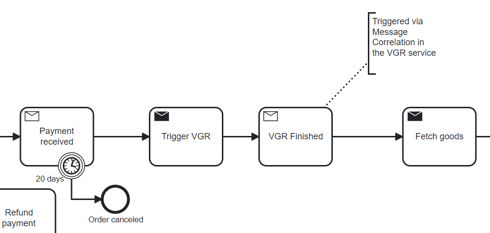
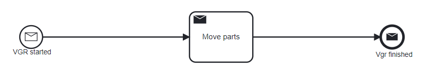

# University of St.Gallen - Exercise Submission

## Course Information

- **Course:** Event-driven and Process-oriented Architectures FS2024
- **Instructors:** B. Weber, R. Seiger, A. Abbad-Andaloussi

## Deadline

- **Submission Date:** 19.03.2024; 23:59 CET
- **[Work distribution](https://github.com/luetzyas/edpo-ss24-drop-shipping-a1-gr4/blob/master/docs/submissions/change_log.md)**

# Exercise 04: Orchestration vs. Choreography in Flowing Retail

### Implementation of Events and Commands in an Orchestrated Architecture

#### Decision
We decided to implement the VGR-Camunda service into the flowing-retail-camunda project by using commands and events.
The Order-Service is now as well responsible for sending commands to the VGR-Camunda service. This maintains the single-responsibility of the Order-Service as the orchestrator of the order-fulfillment process.
The VGR-Camunda service will emit events to notify the Order-Service about the status of its process.

#### Rationale
The other services don't need to know about the VGR-Camunda service and don't need to understand the events it emits. Therefore, the VGR-Camunda service is decoupled from the other services and can be changed without affecting the other services.
The Order-Service will ensure that the commands invoked will be executed in the correct order and that exceptions are handled properly.
This further makes the Order-Service dependent on the VGR-Camunda service (sending-side dependency). 
Given that we assume an order always requires the production of the goods, it also makes sense to keep the communication between the Order-Service and the VGR-Camunda service synchronous. 
Given the coupling in the real world, we accept the coupling in the software architecture. Thanks to Camunda workflow engine, the support for long-running processes is given.

#### Design

The Order-flow orchestrates the VGR during order fulfillment.

1. Trigger VGR sends a command to the VGR-Camunda service.
2. VGR-Camunda service starts its own process.

3. The activity "Move Parts" emits events about the VGRs state.
4. Once the VGR-Camunda service is finished, it emits an event to the Order-Service.

#### Additional Considerations
With further development of the project we plan to extend the usage of smart-factory components.
We might consider to establish an additional orchestrated flow for the production of the goods.
This could mean that the Order-Service no longer sends commands to orchestrate the production but merely emit an event to start the production process governed by an appropriate service.

### Code
[Release](https://github.com/luetzyas/edpo-ss24-drop-shipping-a1-gr4/releases/tag/EDPO_A1_E3_4)

The [README.md](https://github.com/luetzyas/edpo-ss24-drop-shipping-a1-gr4/blob/master/kafka/java/vgr-camunda/README.md) file provides detailed description of VGR-Flow implementation.

