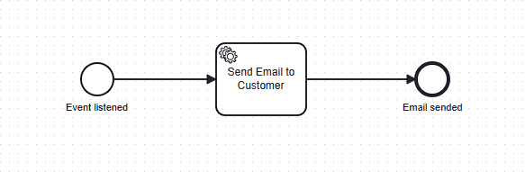

# University of St.Gallen - Exercise Submission

## Course Information

- **Course:** Event-driven and Process-oriented Architectures FS2024
- **Instructors:** B. Weber, R. Seiger, A. Abbad-Andaloussi

## Deadline

- **Submission Date:** DD.MM.2024; 23:59 CET
- **Updated Document based on Feedback:** DD.MM.2024; 20:00 CET
-
    *

*[Work distribution](https://github.com/luetzyas/edpo-ss24-drop-shipping-a1-gr4/blob/master/docs/submissions/change_log.md)
**

# Exercise 05: Zeebe.io

### Code

[Release](https://github.com/luetzyas/edpo-ss24-drop-shipping-a1-gr4/releases/tag/EDPO_A1_E5_6)

The [README.md](../../kafka/java/mailing-zeebe/README.md) file provides detailed description of implementation.

### Integration of Zeebe.io in the Mailing Service

#### Decision

For the Labs in this Exercise a Zeebe Cloud Client approach was introduced and Zeebe along with Kafka. We wanted to
implement the Zeebe.io and decided to duplicate the current Mailing service and integrate Zeebe.io in the new service.
This allows us to compare the two services and evaluate the benefits of Zeebe.io. As well as to have a backup service in
case of failure.

To be able to run different application settings we also created a new
docker-compose [file](../../runner/docker-compose/docker-compose-kafka-java-order-camunda-zeebe.yml).

To test the implementation first a simple service task was introduced in the BPMN model
  

  
before enhancing the logic for the listened events.

#### Rationale

For the implementation of the new Mailing service with Zeebe.io we followed
the [Zeebe.io documentation](https://docs.camunda.io/docs/components/zeebe/zeebe-overview/)
In constrast to our other services we wanted to implement Zeebe in the Mailing service as it is not orchestrated by the
order service but choreographed to react on the applications events.

| Camunda   | Performance, Scalability                                                      | Modern/Cloud                                                                              | Event handling                                                                                  |
|-----------|-------------------------------------------------------------------------------|-------------------------------------------------------------------------------------------|-------------------------------------------------------------------------------------------------|
| 7         | workflow automation for monolithic architecture, which can limit scalability  | deployable environments, requires additional configurations and infrastructure management | Events contraint withing the BPMN execution, coupled to db transations                          | 
| 8 (Zeebe) | distributed workflow engine using stream processing, supports high throughput | cloud-native features (e.g. gpt), docker inclusion, simplified deployment                 | Event-driven architecture (real-time processing = react to events and messages instantaneously) |

#### Additional Considerations

With further development we plan to implement a discount function according to the ordered goods from the customer.
This would mean to implement a decision table in camunda for the discount calculation.

