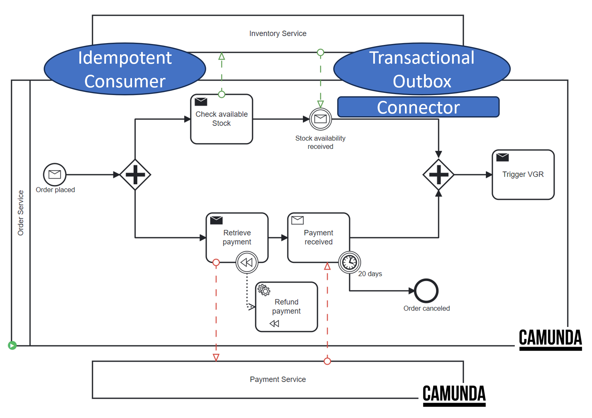

# University of St.Gallen - Exercise Submission

## Course Information

- **Course:** Event-driven and Process-oriented Architectures FS2024
- **Instructors:** B. Weber, R. Seiger, A. Abbad-Andaloussi

## Deadline

- **Submission Date:** 21.04.2024; 23:59 CET
- **[Work distribution](https://github.com/luetzyas/edpo-ss24-drop-shipping-a1-gr4/blob/master/docs/submissions/change_log.md)**

# Exercise 06: Sagas and Stateful Resilience Patterns

### Code

[Release](https://github.com/luetzyas/edpo-ss24-drop-shipping-a1-gr4/releases/tag/EDPO_A1_3.0) 

The
Inventorys [README.md](https://github.com/luetzyas/edpo-ss24-drop-shipping-a1-gr4/blob/master/kafka/java/inventory/README.md)
file provides detailed description of the implementation.

### Implementation of an Outbox Pattern

#### Decision

To enhance reliability and ensure no loss of messages during system failures, we implemented an Outbox Pattern in the
Inventory Service. This architectural choice supports robust integration with Kafka for event-driven communication and
is resilient to service downtimes. The Inventory Service, operating independently from Camunda's process engine,
requires a mechanism to ensure message integrity and order, making the Outbox Pattern an ideal solution.

#### Rationale

The primary motivation for adopting the Outbox Pattern was to prevent message loss in scenarios where the Inventory
Service might experience downtime or disruptions in sending messages directly to Kafka. By leveraging this pattern, we
ensure that:

1. Message Durability: Messages are persisted in a local transactional store (simulated with a queue for this mock
   implementation) before being published to Kafka, protecting against data loss during system failures.
2. Consistency: The Outbox Pattern allows for consistent message delivery that respects the order of operations in the
   Inventory Service, ensuring integrity.
3. Decoupling of responsibilities: It separates the concerns of message generation and publication. While the Inventory
   Service focuses on business logic and message creation, the Outbox Processor handles the reliable delivery of these
   messages to Kafka.

#### Design

The design comprises two main components:

1. Outbox Storage:

- Implemented using a queue to mimic database behavior in a non-persistent environment.
- Messages are stored with a unique identifier (refId) and a status flag indicating whether they have been sent.

2. Outbox Processor:

- A scheduled service that scans the Outbox Storage for unsent messages and processes them.
- Upon successful sending, the message's status is updated to reflect its new state which prevents re-sending.

#### Process Flow:

1. Message Creation: When a state change occurs in the Inventory Service, the resulting message is created and
   immediately stored in the Outbox.
2. Message Processing: The Outbox Processor periodically checks the Outbox for new messages, sends them to the Kafka
   topic, and marks them as sent.
3. Error Handling: If a message fails to send (e.g., due to Kafka being down), it remains in the Outbox to be tried
   again in the next cycle.

#### Additional Considerations

While the current implementation serves the purpose of demonstrating the Outbox Pattern with an in-memory model, several
adaptations are recommended for a production environment:

- Persistent Storage: Unlike the mock setup using a ConcurrentLinkedQueue, a production-grade implementation should use
  a persistent storage solution, like PostgreSQL or MongoDB, to ensure durability and fault tolerance.
- Transactional Integrity: In a production environment, the Outbox Pattern is crucial for ensuring that database
  transactions and message sending are treated as a single unit of work. This means that either both the database
  changes (e.g., inventory updates) and the message addition to the outbox succeed or neither does. This is achieved
  using database transactions where the message is only committed to the outbox table if the associated business
  transaction successfully commits. In contrast, the mock implementation with an in-memory queue does not support true
  transactions. Changes to the "database" (simulated state changes in the service) and additions to the outbox are not
  atomically bound. This could lead to scenarios where a message is sent to Kafka without corresponding changes being
  committed or vice versa, thus breaking the atomicity required for reliable systems.
- Scalability: The in-memory queue should be replaced with a scalable message broker or a reliable distributed cache
  like Redis, which can manage larger volumes of messages and support multiple service instances.
- Integration with Kafka Connect: The current Outbox Poller implementation, while functional, polls at a fixed interval
  and manually sends messages to Kafka. This approach, although straightforward, introduces latency between the message
  being ready to send and its actual delivery. It also does not scale well under high load or in distributed systems
  where multiple instances might compete to send messages. A more refined solution would involve using Kafka Connect,
  which can reliably stream data from a database (or any other source) to Kafka. Kafka Connect ensures that messages are
  produced to Kafka topics as soon as they are committed to the outbox table, leveraging source connectors like Debezium
  for databases. This not only minimizes latency and maximizes throughput but also ensures that message delivery
  semantics are tightly aligned with the database transaction boundaries, thus maintaining exact once delivery
  guarantees that are crucial for data consistency across distributed systems.

### Implementation of an Idempotent Consumer Pattern

As outlined as well in the Inventorys [README.md](https://github.com/luetzyas/edpo-ss24-drop-shipping-a1-gr4/blob/master/kafka/java/inventory/README.md)
file, we implemented an Idempotent Consumer Pattern in the Inventory Service.

Since this pattern is not directly asked for in the assignment, we will not go into detail here. For further information, please refer to the README.md of the Inventory Service.

