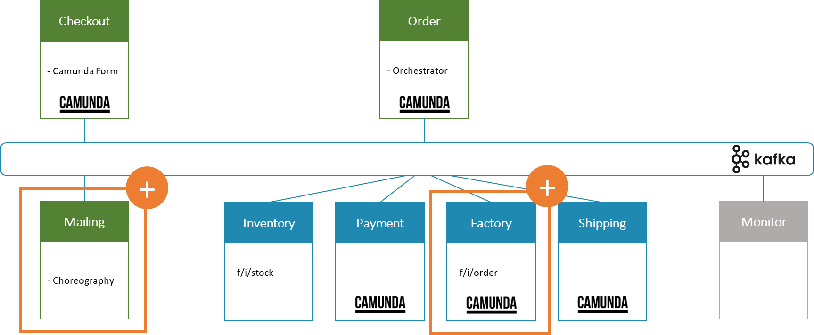
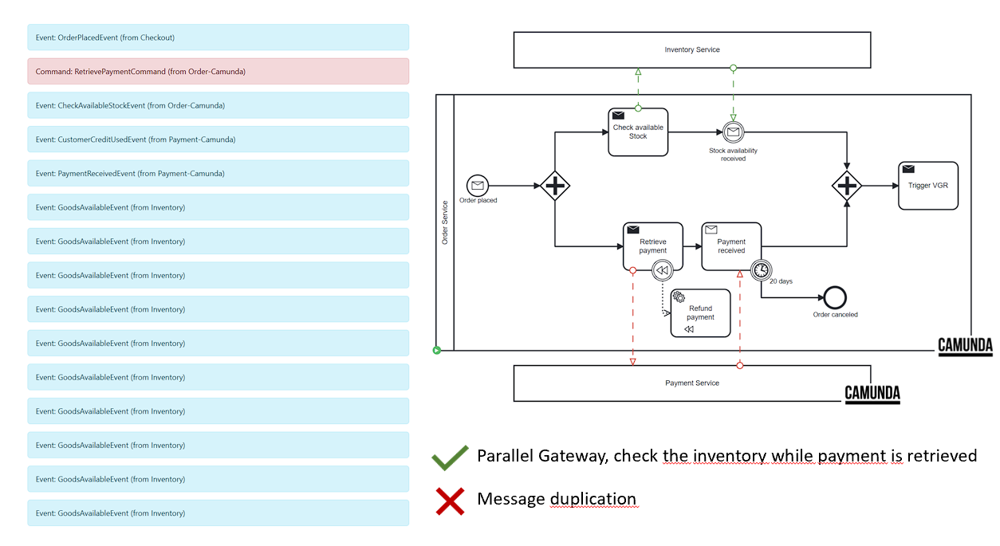

# University of St.Gallen - Exercise Submission

## Course Information

- **Course:** Event-driven and Process-oriented Architectures FS2024
- **Instructors:** B. Weber, R. Seiger, A. Abbad-Andaloussi

## Deadline

- **Submission Date:** 21.04.2024; 23:59 CET
- **[Work distribution](https://github.com/luetzyas/edpo-ss24-drop-shipping-a1-gr4/blob/master/docs/submissions/change_log.md)**

# Final Report

## Code
[Release](https://github.com/luetzyas/edpo-ss24-drop-shipping-a1-gr4/releases/tag/EDPO_A1_3.0)

## General Project Description
What Services did we implement?
Here you can see an enhanced diagram of the flowing-retail application with two additional microservices: Mailing and Factory

The mailing service is choreographed and is listening to all events happening in the flowing-retail process. Its primary role is to keep our customers informed every step of the way by dispatching timely update emails in response to various events triggered throughout the retail process.

Under the choreography section, we have the Checkout Service, which was enhanced to initiate the flowing retail processing via a camunda form (which you will see in the next slide)

Transitioning to the orchestration aspect of our enhancements, we introduce the VGR, or smart factory service. With this service we ensure that the order’s lifecycle is monitored from the factory onwoards. Furthermore, this service actively reacts to order updates and inventory changes within the smart factory setting

The Services Inventory, Payment, Factory and Shipping are all orchestrated by the order service.

Additionally we enhanced the inventory and factory service with MQTT which is subscribed to the smart factory topics “f/i/stock” for inventory and “f/i/order” for the factory service.

### Where does the Choreography end and orchestration start

In our Flowing Retail application, we delve into the rich landscape of service coordination, articulating the nuanced dance between Orchestration and Choreography. The Checkout Service, initiates the sequence of events to start processing the order.

Once the order is placed, it simultaneously demonstrates the concept of Orchestration. Due to high semantic coupling it acts with authoritative knowledge of the entire process flow, conducting each ensuring the order's lifecycle is followed meticulously. (This approach is particularly useful for complex business transactions requiring coordinated steps and when consistency is paramount.)

Complementing this is our Mailing Service, which adheres to the principles of Choreography, responding in a decentralized manner to events as they occur.

### Workflow

In the streamlined orchestration of our Flowing Retail application, events and commands work in concert to drive the process flow. Let’s dissect the mechanics of this interaction:

When a customer completes an order, the Inventory service is prompt to respond with the 'Reserve Goods' command, a critical maneuver to lock in product availability and prevent the risk of overselling. This immediate action is taken upon the order placement and is a testament to our system's responsiveness.

The Inventory is subscribed to the 'f/i/stock' topic. When stock levels change, the Inventory service publishes an 'Inventory Updated' event, a beacon to all listening services, including the Checkout service. This service reacts by saving most current inventory status.

Progressing to the 'Retrieve Payment' command, we ensure that our Payment service only proceeds with financial transactions once product reservation is confirmed. It's a sequential safeguard that fortifies the integrity of our process. Once the payment is successfully retrieved, a ripple effect is triggered, culminating in the 'Trigger Factory' command. This signals the Factory to start production

As we near the completion of the order's journey, the Inventory service is once again mobilized to 'Fetch Goods,' arranging them for the final stage - shipping. This preparation is a choreographed prelude to the Shipping service's execution of the 'Ship Goods' command, where products are dispatched to their final destination.

Throughout each milestone of this journey, the Mailing service, ever attentive, dispatches status updates to our customers. This choreographed communication ensures transparency and engagement, turning the order lifecycle into a narrative shared with the customer.

### Event-carried State Transfer

Every time there's a change in the inventory levels, the Inventory service broadcasts this information as an "Inventory Updated" event. The Checkout service listens to these events and maintains an up-to-date internal copy of the stock levels.

When a customer submits an order through the checkout form, the service can immediately verify if the requested items are available by checking this internal copy, thus avoiding the need to directly query the Inventory service. This results in a more efficient system with reduced load on the Inventory service and quicker feedback to the customer.

If an item is not available, the checkout process doesn't stop there. Instead, it triggers a user task within the BPMN process that asks the customer to confirm or cancel their order.

The system is designed for eventual consistency, meaning that while the Inventory and Checkout services may temporarily have different views of stock levels, they will synchronize over time as new inventory events are received. This design offers a good balance between system responsiveness and data accuracy

### Inventory Service 
In the diagram we have the Order Service which starts two activities in parallel. On one side retrieving the payment, on the other side checking and reserving the materials needed for manufacturing.

While on the payment side everything works as expected, the Inventory struggled with message duplication. As you can see on the left, the GoodsAvailableEvent got processed multiple times.

Our preferred solution here was to Implement idempotent processing logic in the Inventory Service.

The Idempotent Consumer pattern ensures that even if the same message is consumed multiple times, the business logic that processes the message only has an effect once.

### Event Flow
The idea of an Idempotent Consumer is to track received message IDs in the database. The message ID commit happens in the same transaction as any other database writes, making these actions atomic. This will prevent a message being processed twice and ensures data consistency.

Since the Inventory service will also emit an event upon successful processing, we have to ensure reliable message delivery, even in the presence of failures, by integrating an 'outbox' table where messages intended for publishing to Kafka are first stored as part of the business transaction.

A polling loop will continuously check if new messages have been added to the outbox and will eventually send them to kafka and marking them as done.

Given that the inventory service does not use a persistent database, we can simplify those patterns to an in-memory implementation. A Redis DB could be used to scale along multiple instances and ensure persistence across re-starts.

As we can see from the event flow, the GoodsAvailableEvent is now only processed once. The logs show that duplicates are being skipped.

## Reflections and lessons learned

One of the most profound realizations from this project was the inherent complexity of distributed systems, especially when integrating multiple microservices that operate on different parts of a transaction. Implementing Zeebe to manage workflows highlighted the importance of clear boundaries and responsibilities among services, which helped in mitigating complexities related to state and event management.

The Power and Pitfalls of Choreography and Orchestration
Through the implementation of both choreographed and orchestrated processes, we learned valuable lessons about when to employ each strategy:

Choreography is powerful for decoupling services and allowing for independent scaling and development. However, without a central point of control, it became challenging to handle errors and recover from them uniformly across all services.
Orchestration provides a more centralized approach, which simplified some aspects of error handling and made the system's overall behavior more predictable. However, this came at the cost of tighter coupling and potentially reduced flexibility in how services could evolve.
Idempotency and Event Deduplication
One technical challenge that stood out was managing duplicate messages—a common issue in distributed systems with asynchronous messaging. Implementing an idempotent consumer pattern was essential for ensuring that operations such as inventory checks and updates are performed only once, regardless of how many times a message is received. This not only prevented data inconsistencies but also improved system resilience.

**Team Collaboration and Workflow**
This project also underscored the value of effective team collaboration. Utilizing tools like Git for version control and collaborative coding was indispensable. Regular meetings and clear communication channels enabled timely resolution of issues and helped synchronize work across different parts of the project. Each team member's unique skills were leveraged to enhance the project's overall quality and innovation.

It was interesting to implement a variety of patterns and technologies, such as the Outbox Pattern, Zeebe, and Kafka, to address different aspects of distributed systems design. These experiences deepened our understanding of how to build resilient, scalable, and maintainable systems in a distributed environment.
Also to implement BPMN with Camunda 7 and 8 (Zeebe).

This project was not only a technical journey but also a comprehensive learning experience that challenged our understanding of complex system interactions, resilience patterns, and workflow management using modern event-driven architectures. The lessons learned here will undoubtedly influence our future projects and potentially guide our architectural decisions in professional environments.