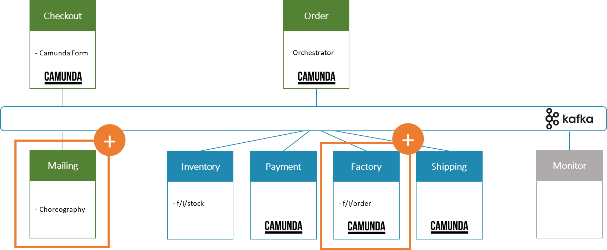
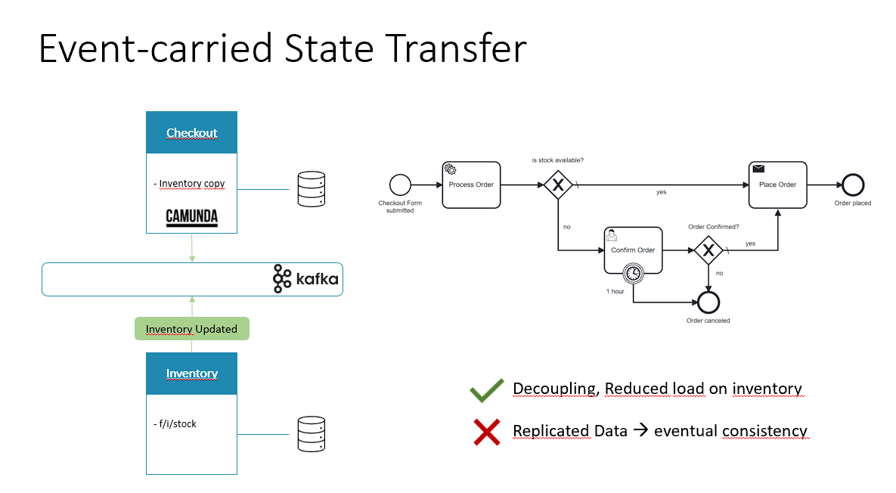
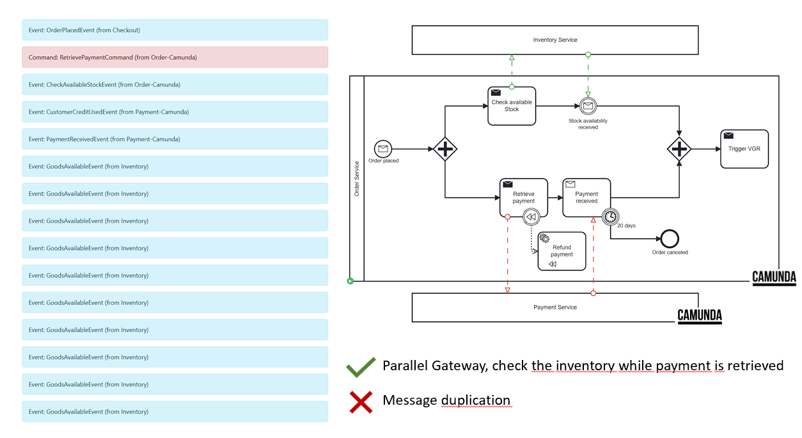
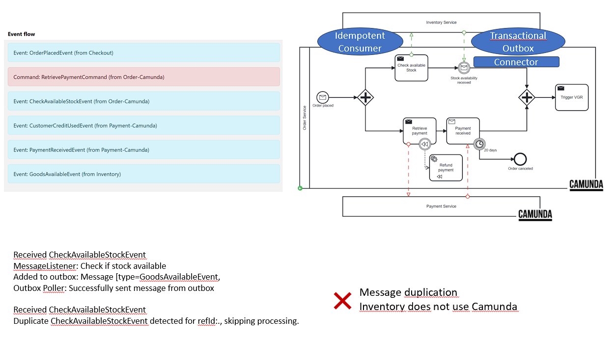

# University of St.Gallen - Exercise Submission

## Course Information

- **Course:** Event-driven and Process-oriented Architectures FS2024
- **Instructors:** B. Weber, R. Seiger, A. Abbad-Andaloussi

## Deadline

- **Submission Date:** 02.05.2024; 23:59 CET
- **[Work distribution](https://github.com/luetzyas/edpo-ss24-drop-shipping-a1-gr4/blob/master/docs/submissions/change_log.md)**

# Final Report

## Code

[Release]()

The [README.md](/kafka/java/mailing/README.md) file provides detailed description of implementation.

## General Project Description

We intro

### Where does the Choreography end and orchestration start

In our Flowing Retail application, we delve into the rich landscape of service coordination, articulating the nuanced
dance between Orchestration and Choreography. The Checkout Service, initiates the sequence of events to start processing
the order.

Once the order is placed, it simultaneously demonstrates the concept of Orchestration. Due to high semantic coupling it
acts with authoritative knowledge of the entire process flow, conducting each ensuring the order's lifecycle is followed
meticulously. (This approach is particularly useful for complex business transactions requiring coordinated steps and
when consistency is paramount.)

Complementing this is our Mailing Service, which adheres to the principles of Choreography, responding in a
decentralized manner to events as they occur.

### Workflow

### Event-carried State Transfer

### Inventory Service

### Event Flow

## Reflections and lessons learned

**Team Collaboration and Workflow**

