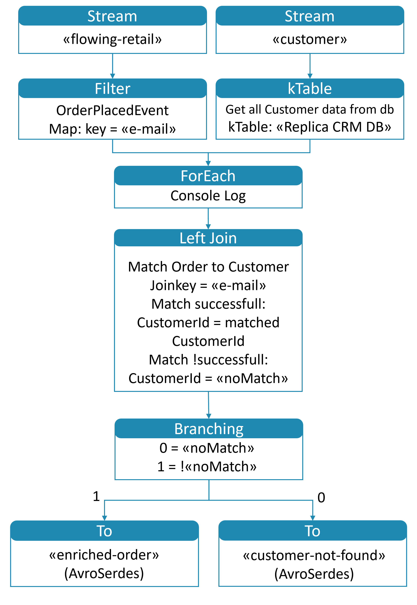

# University of St.Gallen - Exercise Submission

## Course Information

- **Course:** Event-driven and Process-oriented Architectures FS2024
- **Instructors:** B. Weber, R. Seiger, A. Abbad-Andaloussi

## Deadline

- **Submission Date:** 02.05.2024; 23:59 CET
- **[Work distribution](https://github.com/luetzyas/edpo-ss24-drop-shipping-a1-gr4/blob/master/docs/submissions/change_log.md)**

# Final Report

## Code

[Release]()

The [README.md](/kafka/java/mailing/README.md) file provides detailed description of implementation.

## General Project Description

What Services did we implement?
Here you can see an enhanced diagram of the flowing-retail application with two additional microservices: Mailing and
Factory

The mailing service is choreographed and is listening to all events happening in the flowing-retail process. Its primary
role is to keep our customers informed every step of the way by dispatching timely update emails in response to various
events triggered throughout the retail process.

Under the choreography section, we have the Checkout Service, which was enhanced to initiate the flowing retail
processing via a camunda form (which you will see in the next slide)

Transitioning to the orchestration aspect of our enhancements, we introduce the VGR, or smart factory service. With this
service we ensure that the order’s lifecycle is monitored from the factory onwoards. Furthermore, this service actively
reacts to order updates and inventory changes within the smart factory setting

The Services Inventory, Payment, Factory and Shipping are all orchestrated by the order service.

Additionally we enhanced the inventory and factory service with MQTT which is subscribed to the smart factory topics
“f/i/stock” for inventory and “f/i/order” for the factory service.

For the second part of the course, we implemented a new microservice, the CRM service, which manages customer data. 
This service has some data stored in a local database and is also connected to a Kafka topic to receive updates from the
other services.

We introduced Topology classes to track daily orders and item counts by product type. Additionally, 
a join-topology allows us to enrich orders with customer data from our new customer service.
If the customer exists in the database, it will be enriched; otherwise, if the customer cannot be found, we will use a placeholder.

> avro

> monitor enhancements

### Where does the Choreography end and orchestration start

In our Flowing Retail application, we delve into the rich landscape of service coordination, articulating the nuanced
dance between Orchestration and Choreography. The Checkout Service, initiates the sequence of events to start processing
the order.

Once the order is placed, it simultaneously demonstrates the concept of Orchestration. Due to high semantic coupling it
acts with authoritative knowledge of the entire process flow, conducting each ensuring the order's lifecycle is followed
meticulously. (This approach is particularly useful for complex business transactions requiring coordinated steps and
when consistency is paramount.)

Complementing this is our Mailing Service, which adheres to the principles of Choreography, responding in a
decentralized manner to events as they occur.

## Workflow
 // TODO enhnace 

## Concepts

### Event-carried State Transfer

## CRM Service
> new Microservice to manage customer data

## Implemented Topologies

### Daily Orders

<table>
    <tr>
        <td>
            
        </td>
        <td>
            
The <strong>DailyOrdersTopology</strong> class defines the Kafka Streams topology for processing daily orders.

            
This topology processes the 'flowing-retail' topic to log the number of daily orders. The key steps involved in the topology are as follows:

            <ol>
                <li><strong>Stream Initialization</strong>: 
                    
The topology starts by streaming data from the 'flowing-retail' topic.

                </li>
                <li><strong>Filter</strong>: 
                    
The stream is filtered to process only the <em>OrderPlacedEvent</em> type events.

                </li>
                <li><strong>Set Key</strong>: 
                    
The key for each event is set to "all_orders" to aggregate all orders under a common key.

                </li>
                <li><strong>Log Streamed Messages</strong>: 
                    
Each filtered message is logged for later review in the demo, providing visibility into the stream processing.

                </li>
                <li><strong>Group by Key</strong>: 
                    
The filtered and keyed stream is grouped by the key "all_orders". This is necessary for windowed aggregations.

                </li>
                <li><strong>Tumbling Window</strong>: 
                    
The grouped stream is windowed into tumbling windows of 1 day to count the number of orders per day. This ensures that the aggregation is performed on a daily basis.

                </li>
                <li><strong>Count Orders</strong>: 
                    
The orders within each window are counted. The counts are stored in a state store named "daily-order-counts" for persistence and further processing.

                </li>
                <li><strong>Format for Output</strong>: 
                    
The final count for each window is streamed and formatted for console output. The output includes the start time of the window, providing a timestamp for the aggregation period.

                </li>
            </ol>
            
The topology helps in tracking the daily order counts, providing a windowed aggregation of orders that can be used for monitoring and analysis purposes.

        </td>
    </tr>
</table>

### Daily Items

<table>
    <tr>
        <td>
            
        </td>
        <td>
            
The <strong>DailyItemsTopology</strong> class defines the Kafka Streams topology for processing daily items from orders.

            
This topology processes the 'flowing-retail' topic to log the count of items sold daily. The key steps involved in the topology are as follows:

            <ol>
                <li><strong>Stream Initialization</strong>: 
                    
The topology starts by streaming data from the 'flowing-retail' topic, using the custom <em>MessageOrderSerde</em> for deserialization.

                </li>
                <li><strong>Filter and Map</strong>: 
                    
The stream is filtered to process only the <em>OrderPlacedEvent</em> type events. It then maps each order to its items, setting the key to each item's article ID and the value to the amount.

                </li>
                <li><strong>Flat Map</strong>: 
                    
Transforms the list of items in each order into a stream of key-value pairs where the key is the article ID and the value is the quantity.

                </li>
                <li><strong>Group by Key</strong>: 
                    
The item stream is grouped by the article ID. This grouping is essential for the aggregation process that follows.

                </li>
                <li><strong>Windowing</strong>: 
                    
The grouped stream is windowed into tumbling windows of 1 day, similar to the order count in the Daily Orders topology.

                </li>
                <li><strong>Count Items</strong>: 
                    
The number of items sold per day is counted within each window. The counts are stored in a state store for persistence.

                </li>
                <li><strong>Format for Output</strong>: 
                    
The final count of each item for each day is formatted for console output, including the start time of the window to provide a timestamp for the aggregation period.

                </li>
            </ol>
            
This topology enables tracking the quantity of each item sold daily, facilitating detailed analysis and monitoring of sales trends.

        </td>
    </tr>
</table>

### Sensor Data Monitoring

<table>
    <tr>
        <td>
           
        </td>
        <td>
            
The <strong>SensorDataMonitorTopology</strong> class defines the Kafka Streams topology for monitoring sensor data.

            
This topology processes the 'processed-sensor-data' topic to provide insights and aggregations on sensor data streams. The key steps involved in the topology are as follows:

            <ol>
                <li><strong>Stream Initialization</strong>: 
                    
The topology begins by streaming data from the 'processed-sensor-data' topic using the <em>SensorDataSerde</em> for deserialization.

                </li>
                <li><strong>Data Printing</strong>: 
                    
Each sensor data entry is logged to the console for immediate visibility. This step aids in debugging and provides a straightforward way to observe the data flow.

                </li>
                <li><strong>Filter Normal Data</strong>: 
                    
The stream is filtered to process only entries where the key is "normal", focusing on typical sensor behavior.

                </li>
                <li><strong>Aggregate Data</strong>: 
                    
Normal sensor data is aggregated to compute average values per hour. This uses a windowed KTable for efficient data handling and time-based aggregation.

                </li>
            </ol>
            
This topology is essential for real-time monitoring and analysis of sensor data, allowing for the tracking of sensor behavior over time and alerting on anomalies.

        </td>
    </tr>
</table>

### Sensor Data Processing

<table>
    <tr>
        <td>
            
        </td>
        <td>
            
The <strong>SensorDataProcessTopology</strong> class designs a Kafka Streams topology for initial processing and categorization of sensor data.

            
This topology processes the 'sensor-data' topic and categorizes the data into critical and non-critical based on specific conditions. The key steps involved in the topology are:

            <ol>
                <li><strong>Stream Initialization</strong>: 
                    
The topology begins by streaming sensor data from the 'sensor-data' topic using the <em>SensorDataSerde</em> for deserialization.

                </li>
                <li><strong>Filter Critical Conditions</strong>: 
                    
Sensor readings indicating poor air quality (indexed air quality > 100), very high humidity (> 65%), or very high temperature (> 40°C) are filtered as critical data.

                </li>
                <li><strong>Filter Non-Critical Conditions</strong>: 
                    
Conversely, sensor data not meeting these thresholds are considered non-critical and are filtered separately.

                </li>
                <li><strong>Key Mapping</strong>: 
                    
Critical sensor data entries are re-keyed with "critical", and non-critical data entries with "normal", facilitating downstream processing and analysis.

                </li>
                <li><strong>Merge Streams</strong>: 
                    
The two streams, now keyed as 'critical' and 'normal', are merged back together for unified processing or further categorization downstream.

                </li>
            </ol>
            
This topology effectively segregates sensor data into critical and non-critical streams, enabling focused monitoring and faster response to environmental conditions that may pose risks.

        </td>
    </tr>
</table>

### Order Enrichment with Customer Data

<table>
    <tr>
        <td>
            
        </td>
        <td>
            
The <strong>OrderEnrichmentTopology</strong> class outlines a Kafka Streams topology that enriches incoming orders with customer data.

            
This topology processes the 'flowing-retail' topic and enriches each order by linking it with the corresponding customer information. The key steps involved in the topology are as follows:

            <ol>
                <li><strong>Stream Initialization</strong>: 
                    
The topology begins by streaming order data from the 'flowing-retail' topic, using the <em>MessageOrderSerde</em> for deserialization.

                </li>
                <li><strong>Customer Information Table</strong>: 
                    
A KTable is set up to hold customer information, streaming data from the 'customer' topic using the <em>CustomerSerde</em> for deserialization. This table allows for quick lookups of customer data.

                </li>
                <li><strong>Filter and Map Orders</strong>: 
                    
Orders are filtered to process only 'OrderPlacedEvent' types, and the stream is remapped with the order email as the key, facilitating customer data lookup.

                </li>
                <li><strong>Enrich Orders</strong>: 
                    
The customer KTable is joined with the order stream to enrich each order with the corresponding customer details, creating a new stream of enriched orders.

                </li>
                <li><strong>Output to Topic</strong>: 
                    
Enriched orders are then serialized into an Avro format and published to an output topic for further processing or storage.

                </li>
            </ol>
            
This topology enables a deeper analysis of order data by incorporating customer details directly into each order event, enhancing the data's richness for subsequent processing steps or analytical applications.

        </td>
    </tr>
</table>

## Reflections and lessons learned
> Kafka Streams

> Avro
 
> Others

**Team Collaboration and Workflow**
xxxx

