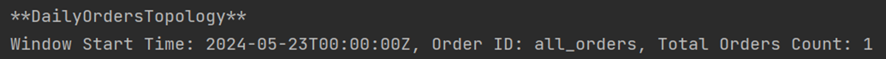
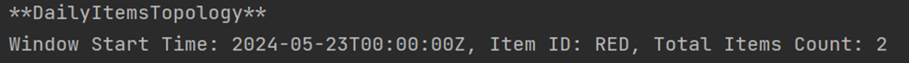
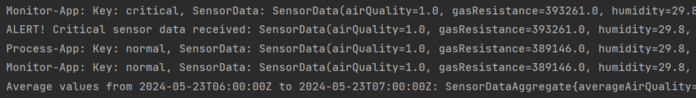
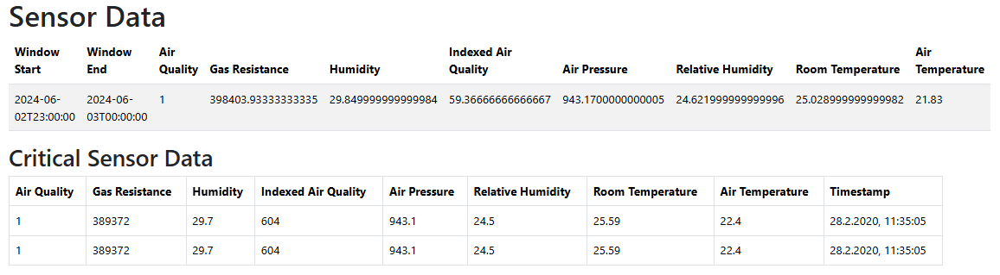
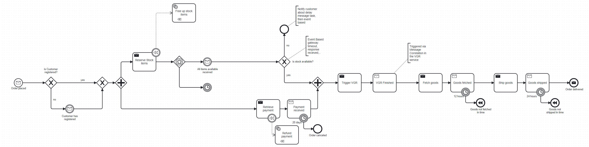

# University of St.Gallen - Exercise Submission

## Course Information

- **Course:** Event-driven and Process-oriented Architectures FS2024
- **Instructors:** B. Weber, R. Seiger, A. Abbad-Andaloussi

## Deadline

- **Submission Date:** 02.05.2024; 23:59 CET
- **[Work distribution](https://github.com/luetzyas/edpo-ss24-drop-shipping-a1-gr4/blob/master/docs/submissions/change_log.md)**

# Final Report

[Revised A1 Report](Assignment_1-revised-Final-Report.pdf)

## Code

[Release](https://github.com/luetzyas/edpo-ss24-drop-shipping-a1-gr4/releases/tag/EDPO_A2)

How to Run: 

Build the project with Maven and use the Docker File docker-compose-kafka-java-order-camunda-schema-registry.yml in the runner folder.

[Intellij Run Confguration](https://github.com/luetzyas/edpo-ss24-drop-shipping-a1-gr4/blob/ee93cee900bf2dcf0193bd347ef074357bca6478/.run/Flowing%20Retail%20Schema%20Registry%20Compose%20up.run.xml)

## General Project Description

As outlined in the report for the first part of the assignment, we have extended the Flowing Retail application.
By including the high-level Smart-factory Dataset through the Factory Service and by having an Order-fulfillment process
we had several options for stream processing.

For the second part of the assignment we enhanced the flowing-retail application with an additional CRM Microservice and
have implemented Kafka Streams topologies in the existing Order Service and the Monitor Service. 

### Service Overview:

**Checkout Service:** Contains a Camunda form to place an order and start the retail process. It will check if the items 
to be ordered are in stock and will notify the customer through a User Task about a potential shortfall of items and 
asking for a confirmation to proceed with the order. If the ordered amount is unusually high, a human intervention 
is triggered via BPMN error and requires an employee to check and sign off the order.

**CRM Service:** Implements a Customer Database which gets initialized with some sample data. Every operation will be
streamed to the Kafka topic customer. The service also has a Camunda Form for Customers to register themselves.

**Order Service:** The Order Service is the heart of the Flowing Retail application. It contains the order 
fulfillment BPMN process integrating the Inventory, Payment, Factory and Shipping services in an orchestrated manner.
The Checkout, CRM, Monitor and Mailing services are also integrated in the process but in an orchestrated manner.

The entry point to the Order Service is it's OrderEnrichmentTopology which consumes the OrderPlacedEvents from the Checkout.
The OrderEnrichmentTopology enriches the order with customer data from the CRM service and then starts the order fulfillment process.
If the Customer could not be matched to the E-Mail used at the Checkout, the flow-instance will wait until the Customer
has signed up via registration form in the CRM Service. The OrderEnrichmentTopology will cause the Mailing Service to send 
a Notification to the Customer providing a link to the registration form. When using the same E-Mail address and
the provided Order-ID the Customer can be matched to the waiting flow-instance and the Order will eventually be processed.

The fulfillment gets parallelized to on the one hand block the required amount of items in the Inventory and on the other hand
to request the Payment. If both are successful the Order will be sent to the Factory for production. The produced items
will be picked up and shipped to the Customer. 

The Order Service further contains the DailyOrdersTopology and the DailyItemsTopology tracking the number of orders and the 
total amount of each item ordered per day.

**Mailing Service:** Listens to all events happening in the flowing-retail process. Its primary
role is to keep our customers informed about the major steps throughout the retail process. It also sends a notification
to the customer if the order could not be processed due to missing customer data. In fact, it will provide the localhost
address of the CRM service in the console output where the registration-flow can be started with the customer-form. 
The notification will contain the Order-ID and the E-Mail address used at the Checkout. Those are the keys to match the 
registration to the waiting flow-instance in the Order Service and the Customer to the Order.

**Factory Service:** Initially implemented with the intention to represent the Vacuum Gripper it evolved into the Smart Factory abstraction. 
In the code we thus refer to it as VGR. In the context of Assignment 2, this Service provides parts of the Smart Factory Dataset.
It has an MQTT client that subscribes to the topic i/bme680 which provides sensor data. The records are directly forwarded
to the Kafka topic sensor-data without processing at this point. 

**Monitor Service:** Is now responsible for the processing of the sensor data. It has two Kafka Streams Topologies.
The SensorDataProcessTopology categorizes the sensor data into critical and non-critical based on specific conditions.
The SensorDataMonitorTopology provides insights by aggregating the normal sensor data to compute average values per hour. 
Also, it logs each critical sensor data entry. The results visualized on the Monitor HTML page. The hourly average values
are displayed in a table and the critical sensor records are listed below in real-time.

**Services as per Report for Assignment 1:** Inventory, Payment, Shipping. 

## Concepts

### State 
**Stateless and Stateful Event Processing:** The topologies within the Flowing Retail application include both 
stateless and stateful operations. Stateless operations, such as map and filter, do not maintain any state between events. 
Stateful operations, such as aggregate, join, and reduce, require maintaining state information across multiple events, 
which is stored in Kafka Streams state stores.

### Serialization and Deserialization
**JSON:** In most cases, we use Serde (Serializer/Deserializer) for JSON serialization and deserialization. 
JSON Serde is used for simple data types and structures where schema evolution is not a major concern.

**Avro:** The EnrichedOrder class is serialized and deserialized using Avro. 
Avro is a popular choice for serialization because it supports schema evolution, 
which is important for maintaining backward and forward compatibility. 
The schema is stored in the schema registry, which ensures consistency across producers and consumers.

### Time Semantics
The Factory Dataset provides sensor data with a timestamp from 2020. We therefore treat the data by relying on the wall time for windowing and aggregation.

**Time windows:** Tumbling Windows: These are fixed-size, non-overlapping windows. 
Tumbling windows are used to segment the data stream into distinct chunks for aggregation. 
In the Flowing Retail application, tumbling windows are used at various stages in the topologies 
to aggregate and process data over fixed intervals.

### Stream Table Duality
**KTable:** A KTable is a changelog stream where each data record represents an update (insert, update, delete) 
of a primary-keyed table. KTable is used for stateful processing and joins

**GlobalKTable:** A GlobalKTable is similar to a KTable but is replicated on all instances of the Kafka Streams application. 
In our application, we haven't used GlobalKTable as we had no use case for a global state store.

**KStream:** A KStream is a record stream of key-value pairs, where each record is treated as an independent event. 
KStream is used for stateless transformations and simple processing tasks.

## Implemented Topologies

### Daily Orders

<table>
    <tr>
        <td>
            
        </td>
        <td>
            
The <strong>DailyOrdersTopology</strong> class defines the Kafka Streams topology for processing daily orders.

            
This topology processes the 'flowing-retail' topic to log the number of daily orders. The key steps involved in the topology are as follows:

            <ol>
                <li><strong>Stream Initialization</strong>: 
                    
The topology starts by streaming data from the 'flowing-retail' topic.

                </li>
                <li><strong>Filter</strong>: 
                    
The stream is filtered to process only the <em>OrderPlacedEvent</em> type events.

                </li>
                <li><strong>Set Key</strong>: 
                    
The key for each event is set to "all_orders" to aggregate all orders under a common key.

                </li>
                <li><strong>Log Streamed Messages</strong>: 
                    
Each filtered message is logged for later review in the demo, providing visibility into the stream processing.

                </li>
                <li><strong>Group by Key</strong>: 
                    
The filtered and keyed stream is grouped by the key "all_orders". This is necessary for windowed aggregations.

                </li>
                <li><strong>Tumbling Window</strong>: 
                    
The grouped stream is windowed into tumbling windows of 1 day to count the number of orders per day. This ensures that the aggregation is performed on a daily basis.

                </li>
                <li><strong>Count Orders</strong>: 
                    
The orders within each window are counted. The counts are stored in a state store named "daily-order-counts" for persistence and further processing.

                </li>
                <li><strong>Format for Output</strong>: 
                    
The final count for each window is streamed and formatted for console output. The output includes the start time of the window, providing a timestamp for the aggregation period.

                </li>
            </ol>
            
The topology helps in tracking the daily order counts, providing a windowed aggregation of orders that can be used for monitoring and analysis purposes.

        </td>
    </tr>
</table>

Example output:

### Daily Items

<table>
    <tr>
        <td>
            
        </td>
        <td>
            
The <strong>DailyItemsTopology</strong> class defines the Kafka Streams topology for processing daily items from orders.

            
This topology processes the 'flowing-retail' topic to log the count of items sold daily. The key steps involved in the topology are as follows:

            <ol>
                <li><strong>Stream Initialization</strong>: 
                    
The topology starts by streaming data from the 'flowing-retail' topic, using the custom <em>MessageOrderSerde</em> for deserialization.

                </li>
                <li><strong>Filter and Map</strong>: 
                    
The stream is filtered to process only the <em>OrderPlacedEvent</em> type events. It then maps each order to its items, setting the key to each item's article ID and the value to the amount.

                </li>
                <li><strong>Flat Map</strong>: 
                    
Transforms the list of items in each order into a stream of key-value pairs where the key is the article ID and the value is the quantity.

                </li>
                <li><strong>Group by Key</strong>: 
                    
The item stream is grouped by the article ID. This grouping is essential for the aggregation process that follows.

                </li>
                <li><strong>Windowing</strong>: 
                    
The grouped stream is windowed into tumbling windows of 1 day, similar to the order count in the Daily Orders topology.

                </li>
                <li><strong>Count Items</strong>: 
                    
The number of items sold per day is counted within each window. The counts are stored in a state store for persistence.

                </li>
                <li><strong>Format for Output</strong>: 
                    
The final count of each item for each day is formatted for console output, including the start time of the window to provide a timestamp for the aggregation period.

                </li>
            </ol>
            
This topology enables tracking the quantity of each item sold daily, facilitating detailed analysis and monitoring of sales trends.

        </td>
    </tr>
</table>

Example output:

### Sensor Data Monitoring

<table>
    <tr>
        <td>
           
        </td>
        <td>
            
The <strong>SensorDataMonitorTopology</strong> class defines the Kafka Streams topology for monitoring sensor data.

            
This topology processes the 'processed-sensor-data' topic to provide insights and aggregations on sensor data streams. The key steps involved in the topology are as follows:

            <ol>
                <li><strong>Stream Initialization</strong>: 
                    
The topology begins by streaming data from the 'processed-sensor-data' topic using the <em>SensorDataSerde</em> for deserialization.

                </li>
                <li><strong>Data Printing</strong>: 
                    
Each sensor data entry is logged to the console for immediate visibility. This step aids in debugging and provides a straightforward way to observe the data flow.

                </li>
                <li><strong>Filter Normal Data</strong>: 
                    
The stream is filtered to process only entries where the key is "normal", focusing on typical sensor behavior.

                </li>
                <li><strong>Aggregate Data</strong>: 
                    
Normal sensor data is aggregated to compute average values per hour. This uses a windowed KTable for efficient data handling and time-based aggregation.

                </li>
            </ol>
            
This topology is essential for real-time monitoring and analysis of sensor data, allowing for the tracking of sensor behavior over time and alerting on anomalies.

        </td>
    </tr>
</table>

### Sensor Data Processing

<table>
    <tr>
        <td>
            
        </td>
        <td>
            
The <strong>SensorDataProcessTopology</strong> class designs a Kafka Streams topology for initial processing and categorization of sensor data.

            
This topology processes the 'sensor-data' topic and categorizes the data into critical and non-critical based on specific conditions. The key steps involved in the topology are:

            <ol>
                <li><strong>Stream Initialization</strong>: 
                    
The topology begins by streaming sensor data from the 'sensor-data' topic using the <em>SensorDataSerde</em> for deserialization.

                </li>
                <li><strong>Filter Critical Conditions</strong>: 
                    
Sensor readings indicating poor air quality (indexed air quality > 100), very high humidity (> 65%), or very high temperature (> 40°C) are filtered as critical data.

                </li>
                <li><strong>Filter Non-Critical Conditions</strong>: 
                    
Conversely, sensor data not meeting these thresholds are considered non-critical and are filtered separately.

                </li>
                <li><strong>Key Mapping</strong>: 
                    
Critical sensor data entries are re-keyed with "critical", and non-critical data entries with "normal", facilitating downstream processing and analysis.

                </li>
                <li><strong>Merge Streams</strong>: 
                    
The two streams, now keyed as 'critical' and 'normal', are merged back together for unified processing or further categorization downstream.

                </li>
            </ol>
            
This topology effectively segregates sensor data into critical and non-critical streams, enabling focused monitoring and faster response to environmental conditions that may pose risks.

        </td>
    </tr>
</table>

Example output of both topologies:

### Order Enrichment with Customer Data

<table>
    <tr>
        <td>
            
        </td>
        <td>
            
The <strong>OrderEnrichmentTopology</strong> class designs a Kafka Streams topology that enriches incoming orders with customer data.

            
This topology processes the 'flowing-retail' topic and enriches each order by linking it with corresponding customer information. The key steps involved in the topology are as follows:

            <ol>
                <li><strong>Stream Initialization</strong>: 
                    
The topology begins by streaming order data from the 'flowing-retail' topic using the <em>MessageOrderSerde</em> for deserialization.

                </li>
                <li><strong>Customer Information Table</strong>: 
                    
A <em>KTable</em> is set up to hold customer information, streaming data from the 'customer' topic using the <em>CustomerSerde</em> for deserialization. This table allows for quick lookups of customer data.

                </li>
                <li><strong>Filter and Map Orders</strong>: 
                    
Orders are filtered to process only 'OrderPlacedEvent' types, and the stream is remapped with the order email as the key, facilitating customer data lookup.

                </li>
                <li><strong>Enrich Orders</strong>: 
                    
The customer <em>KTable</em> is left-joined with the order stream to enrich each order with the corresponding customer details, creating a stream of enriched orders. Orders without matching customer data are identified for further handling.

                </li>
                <li><strong>Branch and Output</strong>: 
                    
The enriched stream is branched into two: one for successfully matched orders that are directed to the 'enriched-order' topic, and another for unmatched orders sent to the 'customer-not-found' topic.

                </li>
            </ol>
            
This topology effectively segregates orders based on customer data availability, enhancing the data's richness for subsequent processing steps or analytical applications while providing pathways for handling anomalies.

        </td>
    </tr>
</table>

## BPMN Extensions
<table>
    <tr>
        <th>Process</th>
        <th>EDPO</th>
        <th>Group 4 A1</th>
        <th>Group 4 A2</th>
    </tr>
    <tr>
        <td>Order</td>
        <td>
            
        </td>
        <td>
            
        </td>
        <td>
            
        </td>
    </tr>
    <tr>
        <td>Checkout</td>
        <td>
            -
        </td>
        <td>
            
        </td>
    </tr>
    <tr>
        <td>Factory</td>
        <td>
            -
        </td>
        <td>
            
        </td>
    </tr>
    <tr>
        <td>CRM</td>
        <td>
            -
        </td>
        <td></td>
        <td>
            
        </td>
    </tr>

</table>

## Reflections and additional lessons learned

### Benfits of Kafka Streams compared to Java Streams
In the first part of the assignment, we used Java Streams to process Inventory and Order Data.
For example, we had to calculate the total amount of items per category in the Inventory or total amount of items per order.
Also, we used Java Streams to handle the Item-Availability check.

The implementation was quite complex and required a lot of code and manual handling of state with Maps and Lists.
Kafka Streams would have been a better choice for this kind of processing as it provides built-in support for stateful operations and 
also it extracts the processing logic into a separate topology which makes the code more readable and maintainable.

### Avro Serialization
We realized that Avro serialization should be manily used as a Data Transfer Object (DTO) between services and does not
necessarily replace the need for POJOs. In our case, we used Avro for the EnrichedOrder class which is the join 
of the Order and the Customer Domain. In this case it was a good choice because the EnrichedOrder only used as DTO.
But still, we had to write a Mapper to create the EnrichedOrder from the Order and Customer POJOs.

We could not use Avro for example for the Customer class in the CRM Service since we require POJOs for the Database. 
More generally, where we required annotations like @Entity, @Id, etc. we could not use Avro.

### Cloud Events 
The Message Class was useful to wrap the actual payload and provide additional metadata. It led to some overhead 
when we had to unwrap the payload in the Kafka Streams Topologies. 

### Kafka still a challenge
Until the end of the assignment, we still had some challenges with the way Kafka requires substantial understanding
of the underlying concepts. Debugging Kafka Streams applications can be challenging due to the various settings and configurations.
Also, we noticed differences when running the application locally and in the Docker container that required
extra installation steps of libraries via Dockerfile.
