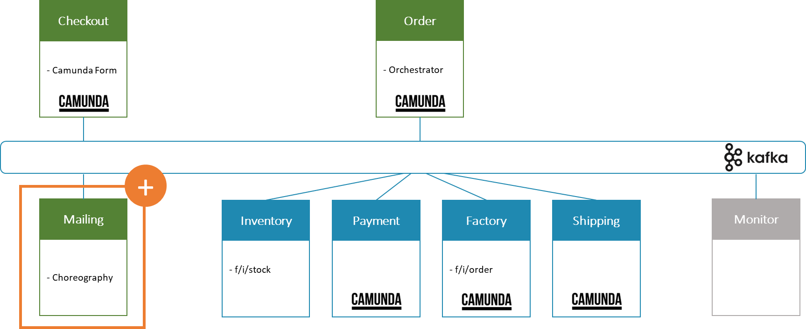

# 1. Add Mailing Service

Date: 2024-04-20

## Status

Implemented

## Context

In the EDPO-SS24 Assignment 1 project, the current architecture encompasses services for: Checkout, Order, Inventory,
Payment, Shipping and Monitor. Each of these services plays a crucial role in the order fulfillment process. However, there is a
need for a dedicated service to handle communication with customers throughout the order process, from confirmation to
shipping notifications. This leads to the proposal of adding a Mailing Service.

## Decision

We have decided to introduce a Mailing Service into the flowing-retail architecture which will be choreographed. This
service will be responsible for the communication with the customers order.
Although the Mailing service will listen to all events occurring during the process, only for the following a mail will
be dispatched:

- Order placed
- (Discount granted)
- Payment received
- GoodsShippedEvent
- OrderCompletedEvent
- VgrFinishedEvent (mail for internal processing with the factory not for the customer)

  

- **Workflow and Choreography:**
  The Mailing Service will subscribe to events all services to trigger customer communications.
  This loose coupling allows for independent scaling and evolution of the communication processes.
- **Fault Tolerance:** As an independent service, the Mailing Service can be designed with robust error-handling and
  retry mechanisms specific to email delivery and notification services, thus preventing email failures from affecting
  core processing
- **Responsiveness and Performance**: Separating the mailing functionality allows the core transactional services to
  remain focused and performant, without being bogged down by the additional load of sending communications.
- **Service Functionality:** The Mailing Service adheres to the single-responsibility principle, taking on all
  responsibilities related to customer communication, which streamlines the development and maintenance of this specific
  functionality.

## Consequences

The addition of the Mailing Service is expected to lead to an improvement in the separation of concerns within the
architecture, allowing for more focused development and optimization of customer communication processes. It will
enhance the user experience by ensuring timely and reliable communication, while also allowing the core services to
operate with reduced complexity and overhead.

Furthermore, this change will enable better scalability as the Mailing Service can be scaled independently in response
to varying load, which is common in communication services.

The introduction of the Mailing Service will also require additional monitoring and logging to ensure the corectness of
the handled events to mail to the customer. By implemented new Events the mailing service also needs to be considered to
enhance its logic for customer communication.