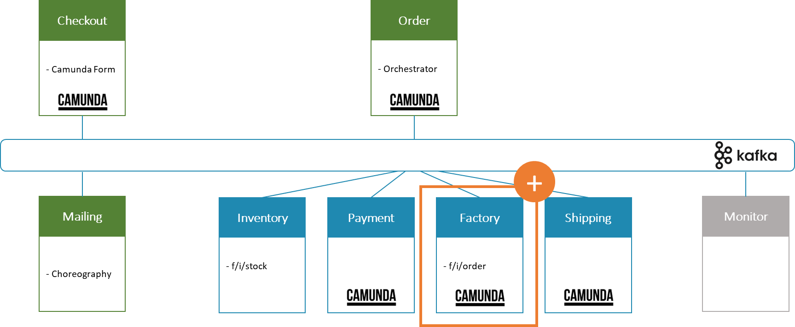

# 2. Add Factory Service

Date: 2024-04-20

## Status

Implemented

## Context

In the EDPO-SS24 Assignment 1 project, the current architecture encompasses services for: Checkout, Order, Inventory,
Payment, Shipping and Monitor. Each of these services plays a crucial role in the order fulfillment process.
A microservice that listens to events from the smart factory via MQTT to check inventory levels and update order
details accordingly can significantly enhance the efficiency of the order fulfillment process.

## Decision

The choice to incorporate the Factory Service, which uses MQTT to listen for events from the smart factory, ensures that
inventory data and order data are synchronized in real time.
The Factory ([VGR](../../../kafka/java/vgr-camunda)) service will subscribe to the topic: `f/i/order` to reflect the
current status of the order at the smart factory.
<br></br>


### Granularity Disintegrators

- **Workflow and Choreography:**
  This microservice is orchestrated by the Order Service, which ensures that the order fulfillment process is enriched
  with up-to-date inventory information.
- **Service Functionality:** The Factory Service adheres to the single-responsibility principle, taking on all
  responsibilities related to the smart factory, which streamlines the development and maintenance of this specific
  functionality.
- **Scalability Needs:** Given the variability in inventory event volume, the microservice must be able to scale
  independently from other services, ensuring responsiveness during peak factory activity.
- **Fault Tolerance and Resilience:** The Inventory Service must robustly handle message loss, duplication, or
  communication failures, which are inherent risks when dealing with MQTT and factory environments.

## Consequences

The integration of this microservice is anticipated to bring significant benefits, including more accurate order
fulfillment and reduced risk of stock discrepancies. This addition is expected to align with the overall system's
performance objectives and contribute to a more resilient and adaptable
architecture.

This granularity-focused approach aims to achieve a balanced and efficient system where each microservice operates
within its scope effectively while collectively contributing to the project's goals. By closely integrating with the
smart factory, the service will enable a more dynamic and flexible order fulfillment process.

Because the inventory depends on the smart factory, maintenance is necessary whenever the factory's settings or MQTT
topics change. To make sure the Factory Service keeps operating correctly and effectively, it will need to be watched
over and maintained.

## MQTT Settings

```properties
# MQTT
mqtt.host=tcp://ftsim.weber.ics.unisg.ch
mqtt.username=ftsim
mqtt.password=unisg
mqtt.port=1883
mqtt.topic=f/i/order
```