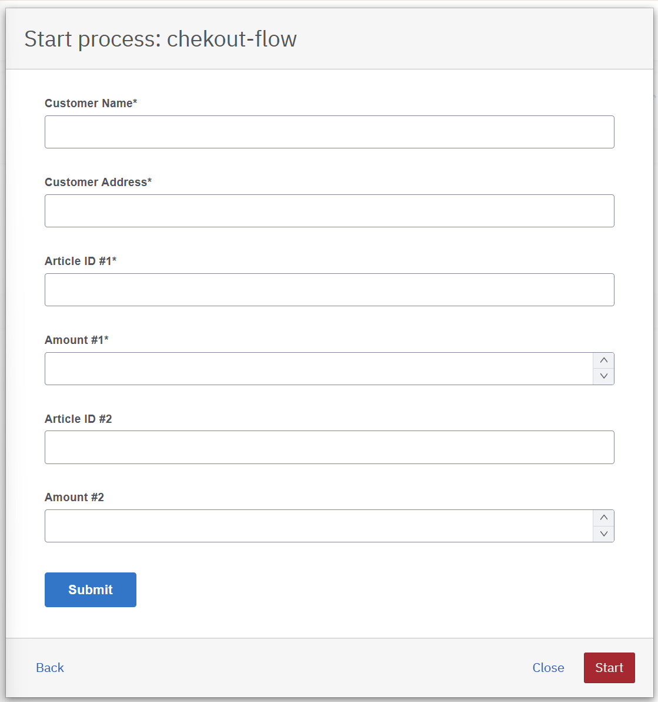
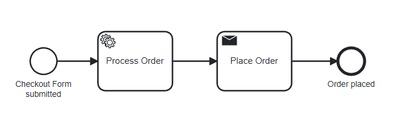

# Checkout-Camunda

The provided checkout services has been modified to make use of the Camunda Forms for the checkout instead of the previous implementation.

Only changes to given code are documented here.

## How to run
1. Open [http://localhost:8091/](http://localhost:8091/) to see the Camunda Webapp
2. Login with `demo`/`demo`
3. Open Tasklist &rarr; `Start process` &rarr; `checkout-flow`
4. The `checkout-form` will be displayed



5. Fill in the form and submit

This will trigger an OrderPlacedEvent.

## Implementation

### Enable Camunda
- Camunda is enabled and configured via 
  - [application.properties](src/main/resources/application.properties)
  - and [pom.xml](pom.xml)

### Camunda Form to place an order
- Form is defined in [checkout-form.form](src/main/resources/checkout-form.form)
  - Form gets auto-deployed by setting property `camunda.bpm.auto-deployment-enabled=true` and creating dir `src/main/resources/META-INF` with file `processes.xml` which can remain empty.


### BPMN Process to handle the order 
- Process is defined in [checkout-flow.bpmn](src/main/resources/checkout-flow.bpmn)



1. Start event is referenced to the form via id `checkout-form` so after submitting the form, the process will be started.
2. Service Task Process Order is a delegate expression to `processOrderAdapter` which is implemented in [ProcessOrderAdapter.java](src/main/java/io/flowing/retail/checkout/flow/ProcessOrderAdapter.java)
  - The `execute` method extracts the form data and constructs an Order object.
  - The Order object is then set as a process variable `order` which can be used in the process.
```java
...
String customerName = (String) execution.getVariable("customerName");
...
Order order = new Order();
order.setCustomer(new Customer(customerName, customerAddress));

execution.setVariable("order", order); 
```
3. The Send Task Place Order is a delegate expression to `placeOrderAdapter` which is implemented in [PlaceOrderAdapter.java](src/main/java/io/flowing/retail/checkout/flow/PlaceOrderAdapter.java)
  - The `execute` method extracts the order from the process variable and sends an OrderPlacedEvent to Kafka.
```java
Order order = (Order) execution.getVariable("order");
Message<Order> message = new Message<>("OrderPlacedEvent", order);
messageSender.send(message);
```

### Deleted static checkout page
- Removed `ShopRestController`, `TomcatConfiguration` and `shop.html`
- [http://localhost:8091/](http://localhost:8091/) now shows the Camunda Webapp instead of html checkout page
