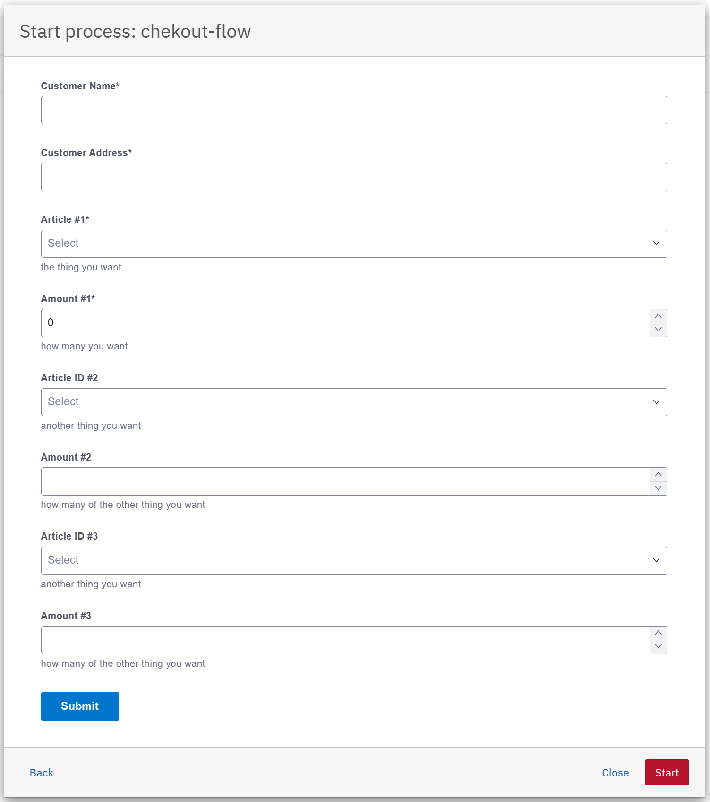
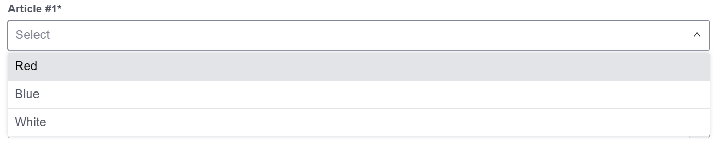
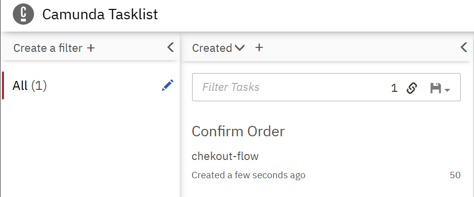
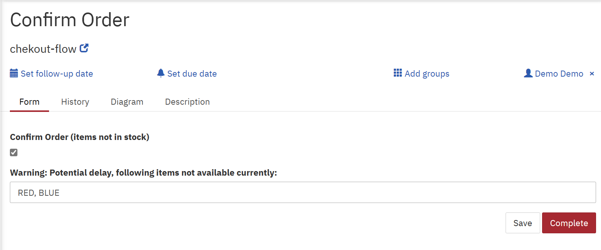
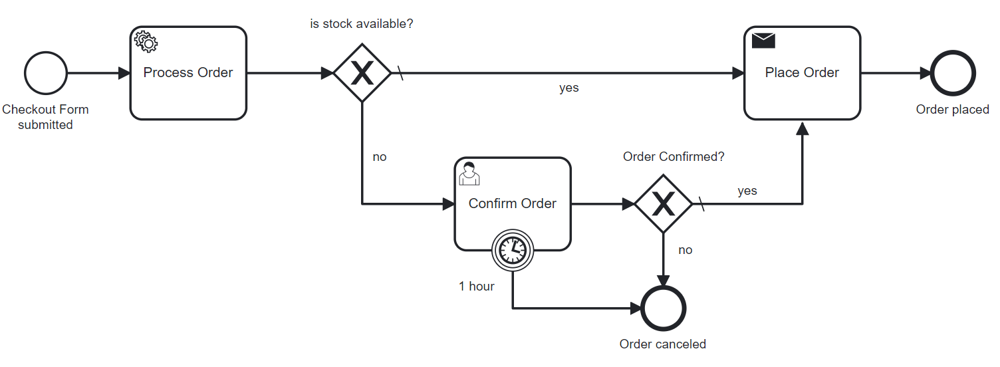
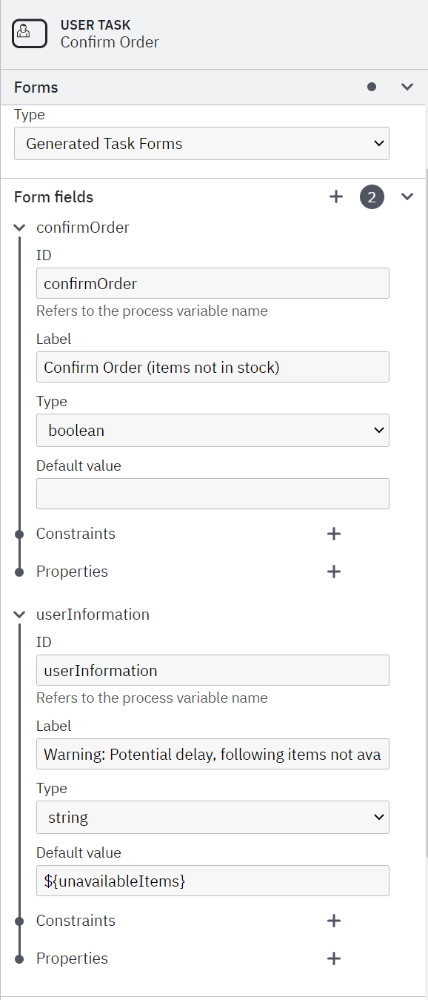

# Checkout-Camunda

The provided checkout services has been modified to make use of the Camunda Forms for the checkout instead of the previous implementation.

Only changes to given code are documented here.

## How to run
1. Open [http://localhost:8091/](http://localhost:8091/) to see the Camunda Webapp
2. Login with `demo`/`demo`
3. Open Tasklist &rarr; `Start process` &rarr; `checkout-flow`
4. The `checkout-form` will be displayed



Select the items from the dropdown list and specify the quantity.



5. Fill in the form and submit

6. `Process Order` Service Task:
    - Form data is extracted and an Order object is created and set as instance-variable.
    - If an item of the same type (Red 2x and Red 3x) was ordered, the quantity is aggregated (Red 5x).
    - For each item, the ordered amount is checked against the local replica of the inventory data. 
   If no sufficient quantity is available the instance-variable `allItemsAvailable` is set to `false` and each item type which is not available is added to the instance-variable `unavailableItems`

7. `is stock available?` Exclusive Gateway:
    - If `allItemsAvailable` is true, the process continues with the `Place Order` Send Task.
    - If not, the process continues with the `Confirm Order` User Task.

8. `Confirm Order` User Task:
   - In the Tasklist of Camunda, the `Confirm Order` task is displayed (refresh the page).
  
    

   - Claim the task, Order can be confirmed or not. Not available items are displayed.
     
    

   - If the order is not confirmed, or after 1h timeout, the process ends.
   - If the order is confirmed, the process continues with the `Place Order` Send Task.

9. `Place Order` Send Task:
    - The Order object is extracted from the instance-variable and sent to Kafka as an OrderPlacedEvent.

## Implementation

### Enable Camunda
- Camunda 7 is enabled and configured via 
  - [application.properties](src/main/resources/application.properties)
  - and [pom.xml](pom.xml)

### Camunda Form to place an order
- Form is defined in [checkout-form.form](src/main/resources/checkout-form.form)
- Form gets auto-deployed by setting property `camunda.bpm.auto-deployment-enabled=true` and creating dir `src/main/resources/META-INF` with file `processes.xml` which can remain empty.


### BPMN Process to handle the order 
- Process is defined in [checkout-flow.bpmn](src/main/resources/checkout-flow.bpmn)




1. `Start event` is referenced to the Camunda-Form via id `checkout-form` so after submitting the form, the process will be started.
2.  `Process Order` is a delegate expression to `processOrderAdapter` which is implemented in [ProcessOrderAdapter.java](src/main/java/io/flowing/retail/checkout/flow/ProcessOrderAdapter.java)
  - The `execute` method extracts the form data and constructs an Order object. Items of the same type are aggregated.

```java
// Create a new order
Order order = new Order();
// Set customer details
Customer customer = new Customer();
customer.setName((String) execution.getVariable("customerName"));
customer.setAddress((String) execution.getVariable("customerAddress"));
order.setCustomer(customer);

// Aggregate items by articleId
Map<String, Integer> aggregatedItems = new HashMap<>();
for (int i = 1; i <= 3; i++) { // 3 items Red/Blue/White
    String articleId = (String) execution.getVariable("articleId" + i);
    Integer amount = (Integer) execution.getVariable("amount" + i);

    if (articleId != null && amount != null) {
        aggregatedItems.merge(articleId, amount, Integer::sum);
    }
}

// Add aggregated items to the order
aggregatedItems.forEach(order::addItem);
```
   
  - The ordered amount of each item is checked against the local replica of the inventory data.

```java
List<String> unavailableItems = new ArrayList<>();

for (Map.Entry<String, Integer> entry : aggregatedItems.entrySet()) {
    String articleId = entry.getKey();
    Integer requiredAmount = entry.getValue();

    FactoryStockState stockState = checkoutService.getCurrentStockState().get(articleId);
    if (stockState == null || stockState.getAmount() < requiredAmount) {
        // Item is not available in sufficient quantity
        unavailableItems.add(articleId);
        System.out.println("Insufficient stock for item: " + articleId);
    }
}
```

  - Instance-variables `allItemsAvailable` and `unavailableItems` are set accordingly as well as the `order` object.

```java
...
// Check overall availability based on Workpiece types and their amounts
boolean allItemsAvailable = unavailableItems.isEmpty();
if (!allItemsAvailable) {
    execution.setVariable("allItemsAvailable", false);
    execution.setVariable("unavailableItems", String.join(", ", unavailableItems));
} else {
    execution.setVariable("allItemsAvailable", true);
}
execution.setVariable("order", order); // Store the order object for the next task
```

3. `is stock available?` Exclusive Gateway evaluates `${allItemsAvailable}`

4. `Confirm Order` User Task
    - Process variable `${unavailableItems}` is used to display respecitve items in the generated form.

   


5. The Send Task `Place Order` is a delegate expression to `placeOrderAdapter` which is implemented in [OrderPlacedAdapter.java](src/main/java/io/flowing/retail/checkout/flow/OrderPlacedAdapter.java)
  - The `execute` method extracts the order from the process variable and sends an OrderPlacedEvent to Kafka.
```java
Order order = (Order) execution.getVariable("order");
Message<Order> message = new Message<>("OrderPlacedEvent", order);
messageSender.send(message);
```

### Deleted static checkout page
- Removed `ShopRestController`, `TomcatConfiguration` and `shop.html`
- [http://localhost:8091/](http://localhost:8091/) now shows the Camunda Webapp instead of html checkout page
