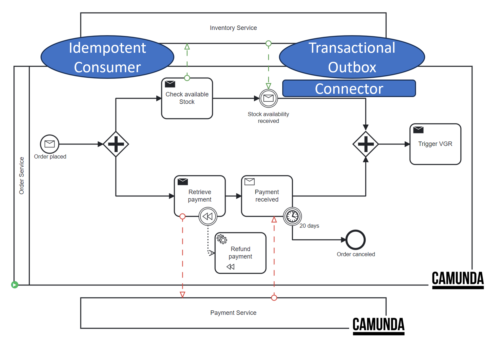

# Inventory Service

The Inventory Service is intentionally not integrated with Camunda to demonstrate an alternative.

## Implementation

### Resources

[application.properties](src/main/resources/application.properties) contains the configuration for the Kafka server.

```properties
flowing-retail.topic-name=flowing-retail
spring.kafka.bootstrap-servers=kafka:9092
spring.kafka.consumer.auto-offset-reset=latest
````

### Flow

### Smart Factory Integration

This Services is also configured to listen to the Smart Factory MQTT-topic `f/i/stock`.

1. The [MqttConfig.java](src/main/java/io/flowing/retail/inventory/mqtt/MqttConfig.java) configures the MQTT client to
   listen to the `f/i/stock` topic with following properties.

````Properties
# MQTT
mqtt.host=ftsim.weber.ics.unisg.ch
mqtt.username=ftsim
mqtt.password=unisg
mqtt.port=1883
mqtt.protocol=tcp://
mqtt.topic=f/i/stock
````

- It uses the spring-integration-mqtt library to create an `mqttInputChannel`.

````maven
<dependency>
	<groupId>org.springframework.integration</groupId>
	<artifactId>spring-integration-mqtt</artifactId>
	<version>6.2.3</version>
</dependency>
````

2. The [StockStateUpdater.java](src/main/java/io/flowing/retail/inventory/mqtt/StockStateUpdater.java) listens to
   the `mqttInputChannel` and processes the incoming messages.

- It replaces the `None` value with `null` for clean JSON parsing. Then invokes the `inventoryService` to update the
  stock.

````Java
@ServiceActivator(inputChannel = "mqttInputChannel")
public void updateOrderState(Message<String> message){
        String lastStateJson=message.getPayload().replace("None","null");
        try{
        InventoryUpdateMessage updateMessage=objectMapper.readValue(lastStateJson,InventoryUpdateMessage.class);
        inventoryService.updateStock(updateMessage);
        }catch(Exception e){
        e.printStackTrace();
        }
        }
````

3. The [InventoryService.java](src/main/java/io/flowing/retail/inventory/application/InventoryService.java) updates the
   stock in the ConcurrentHashMap `stockStateMap`. If there was an actual change in the stock,
   an `InventoryUpdatedEvent` is created.

````Java
public void updateStock(InventoryUpdateMessage updateMessage){
        Map<String, FactoryStockState> tempMap=new HashMap<>();

        for(InventoryUpdateMessage.StockItem stockItem:updateMessage.getStockItems()){
        InventoryUpdateMessage.Workpiece workpiece=stockItem.getWorkpiece();
        if(workpiece!=null){
        tempMap.compute(workpiece.getType(),(key,existingVal)->{
        if(existingVal==null){
        return new FactoryStockState(key,1);
        }else{
        existingVal.incrementAmount();
        return existingVal;
        }
        });
        }
        }
        ...

        stockStateMap.putAll(tempMap);
````

#### Event-Carried State Transfer Pattern

- To enable the Checkout Service to be aware of the current stock, the Inventory Service publishes
  an `InventoryUpdatedEvent` to the Kafka topic `flowing-retail`.
- In this specific example, the Checkout Service is subscribed to the `InventoryUpdatedEvent`. The pattern would allow
  any interested service to subscribe as well in order to be aware of the current stock.
- This pattern reduces the load on the Inventory Service as other services don't need to query the Inventory Service for
  the current stock.

````Java
public void updateStock(InventoryUpdateMessage updateMessage){
        ...
        if(!mapsAreEqual(stockStateMap,tempMap)){
        stockStateMap.putAll(tempMap);

        InventoryUpdatedEventPayload payload=new InventoryUpdatedEventPayload(stockStateMap);
        Message<InventoryUpdatedEventPayload> messagePayload=new Message<>("InventoryUpdatedEvent",UUID.randomUUID().toString(),payload);
        InMemoryOutbox.addToOutbox(messagePayload);
        }
        }
// Utility method to compare two maps
private boolean mapsAreEqual(Map<String, FactoryStockState> oldMap,Map<String, FactoryStockState> newMap){
        if(oldMap.size()!=newMap.size()){
        return false;
        }
        return oldMap.entrySet().stream()
        .allMatch(e->e.getValue().equals(newMap.get(e.getKey())));
        }
````

### Idempotent Consumer / Outbox Pattern



#### Idempotent Consumer Pattern

Due to message duplication in Kafka, the Inventory Service implements the Idempotent Consumer Pattern to ensure that the
same message is not processed multiple times.

The idea of an Idempotent Consumer is to track received message IDs in the database. The message ID commit happens in
the same transaction as any other database writes, making these actions atomic. This will prevent a message being
processed twice and ensures data consistency. Here, we use an in-memory solution for simplicity which does not provide atomicity.

1. The [MessageListener.java](src/main/java/io/flowing/retail/inventory/messages/MessageListener.java) checks if the
   incoming message has already been processed using the refId.

````Java
// Check if the message has already been processed
if(idempotentReceiver.isDuplicate(checkAvailableStockEvent.getRefId())){
        System.out.println("Duplicate CheckAvailableStockEvent detected for refId: "+checkAvailableStockEvent.getRefId()+", skipping processing.");
        return;
        }
````

2. The [IdempotentReceiver.java](src/main/java/io/flowing/retail/inventory/messages/IdempotentReceiver.java) stores the
   processed refIds in a Set. It adds a refId to the Set if it is not already present.

````Java

@Component
public class IdempotentReceiver {
    private Set<String> processedIds = Collections.newSetFromMap(new ConcurrentHashMap<>());

    public boolean isDuplicate(String refId) {
        return !processedIds.add(refId);
    }
}
````

#### Outbox Pattern

Since the Inventory service will also emit an event upon successful processing, we have to ensure reliable message
delivery, even in the presence of failures, by integrating an 'outbox' table where messages intended for publishing to
Kafka are first stored as part of the business transaction.

[InMemoryOutbox.java](src/main/java/io/flowing/retail/inventory/messages/InMemoryOutbox.java) is an in-memory
implementation of the outbox pattern. It stores messages in a ConcurrentLinkedQueue.

````Java

@Component
public class InMemoryOutbox {
    private static final ConcurrentLinkedQueue<Message<?>> outbox = new ConcurrentLinkedQueue<>();

    public static void addToOutbox(Message<?> message) {
        outbox.add(message);
    }

    public static Message<?> pollMessage() {
        return outbox.poll(); // This retrieves and removes the head of the queue, or returns null if empty
    }
}
````

A polling loop will continuously check if new messages have been added to the outbox and will eventually send them to
kafka and marking them as done. To benefit from fault tolerance, this should be a separate service. Here we simplify it
by placing it into a separate package. Also, using Kafka Connect would be a more robust solution.

Given that the inventory service does not use a persistent database, we can simplify those patterns to an in-memory
implementation. A Redis DB could be used to scale along multiple instances and ensure persistence across re-starts.

To benefit from Transactional Integrity, the message would only be committed to the outbox table if the associated
business transaction successfully commits. This is not possible in the current in-memory implementation.

The [OutboxPoller.java](src/main/java/io/flowing/retail/inventory/connector/OutboxPoller.java) polls the outbox every
second and sends the message to Kafka.

````Java

@Component
public class OutboxPoller {
    @Autowired
    private MessageSender messageSender;

    @Autowired
    private InMemoryOutbox outbox;

    @Scheduled(fixedDelay = 1000) // Poll every second
    public void pollOutbox() {
        Message<?> message;
        while ((message = outbox.pollMessage()) != null) {
            try {
                messageSender.send(message);
                System.out.println("Outbox Poller: Successfully sent message from outbox: " + message);
            } catch (Exception e) {
                System.err.println("Outbox Poller: Failed to send message, will retry: " + e.getMessage());
                // re-add to the queue
                outbox.addToOutbox(message);
            }
        }
    }
}
````

Requires the following configuration to enable scheduling:

````Java

@Configuration
@EnableScheduling
public class SchedulingConfig {
    // This class intentionally left blank. Ideally, placed in a config package.
}
````

