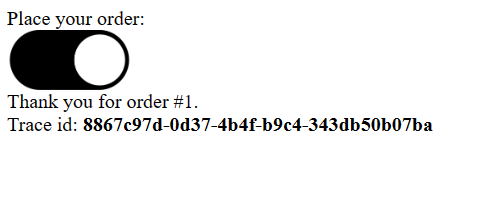
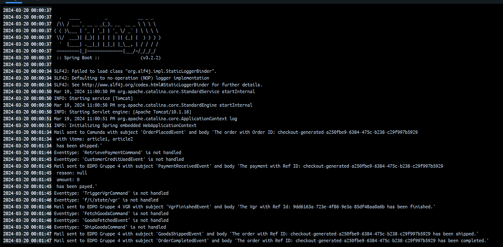
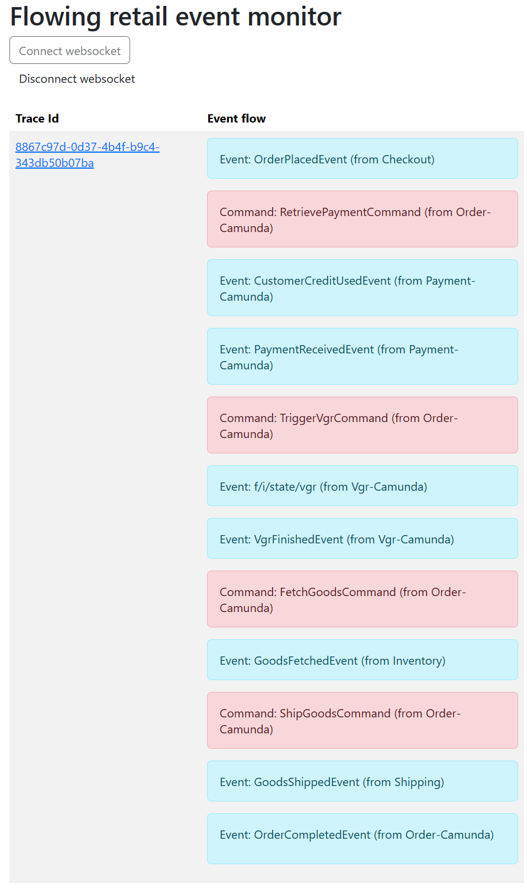

# Mailing Service

## Run

The service is integrated with the `flowing-retail` application. 

In the docker-compose file, the service is defined as a separate service.

```yaml
mailing:
  build:
  context: ../../kafka/java/mailing
  dockerfile: Dockerfile
  networks:
    - flowing
  ports:
    - "8096:8096"
  depends_on:
    - kafka
  environment:
    - SPRING_KAFKA_BOOTSTRAP_SERVERS=kafka:9092`
```

It is started when the relevant projects have been built at least once:

```
  $ cd .\kafka\java\
  $ mvn clean install
```

And afterwards you run from the directory [runner/docker-compose](runner/docker-compose).

```shell
  $ docker-compose -p docker-choreography -f docker-compose-kafka-java-choreography.yml up --build
```
```shell
  $ docker-compose -p docker-order-camunda -f docker-compose-kafka-java-order-camunda.yml up --build
```

## Implementation

### Properties
[application.properties](src/main/resources/application.properties) contains the configuration for the Kafka consumer and the mail server.

```properties
drop-shipping.topic-name=drop-shipping
spring.kafka.bootstrap-servers=kafka:9092
spring.kafka.consumer.auto-offset-reset=latest
````

### Message Listener
[MessageListener.java](src/main/java/io/drop/shipping/mailing/messages/MessageListener.java)

The Mailing Microservice listens to the topics: `flowing-retail` 

```java
@KafkaListener(id = "mailing", topics = "flowing-retail")
public void handleEvent(String messageJson, @Header("type") String messageType) throws Exception {...
```

### Flow
1. Create new Order on [http://localhost:8091](http://localhost:8091/)



2. Upon event emission, the `Mailing Service` captures and logs the message for events such as :
- OrderPlacedEvent
- PaymentReceivedEvent
- GoodsShippedEvent
- OrderedCompletedEvent
- VGRFinishedEvent

```java
// look for the event type and call the corresponding method
try {
    switch (messageType) {
        case "OrderPlacedEvent": //step 1
            sendMailForOrderPlacedEvent(messageJson, messageType);
            break;
        ...
        default:
            System.out.println("Received unsupported event type: " + messageType);
    }
} catch (Exception e) {
    System.out.println("Error processing message" + e);
}

```

3. The service dispatches email notifications for each event type, leveraging specific sendMail...() methods that process the event payload.
- It is implemented in the MailingService.java class 
```java
// send mail for OrderPlacedEvent
public void sendMailForOrderShippedEvent(String messageJson, String messageType) throws Exception {
    try {
        Message<GoodsShippedEventPayload> message = objectMapper.readValue(messageJson, new TypeReference<Message<GoodsShippedEventPayload>>() {
        });
        GoodsShippedEventPayload eventPayload = message.getData();

        String emailSubject = messageType;
        String emailContent = "The order with ID " + eventPayload.getShipmentId() + " has been shipped.";
        String recipient = "EDPO Gruppe 4"; // This should be replaced with the actual recipient from the payload

        sendMail(emailSubject, emailContent, recipient);

    } catch (Exception e) {
        System.out.println("Error " + Thread.currentThread().getStackTrace() + e);
    }
}
```

The docker-compose logs provide real-time feedback on the Mailing Service activities:
- handled Events
- unhandled Events -> information about the unsupported event type



### Summary of the flow
For an overarching view of how the Mailing Service interacts within the application flow:

