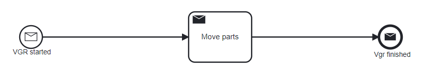
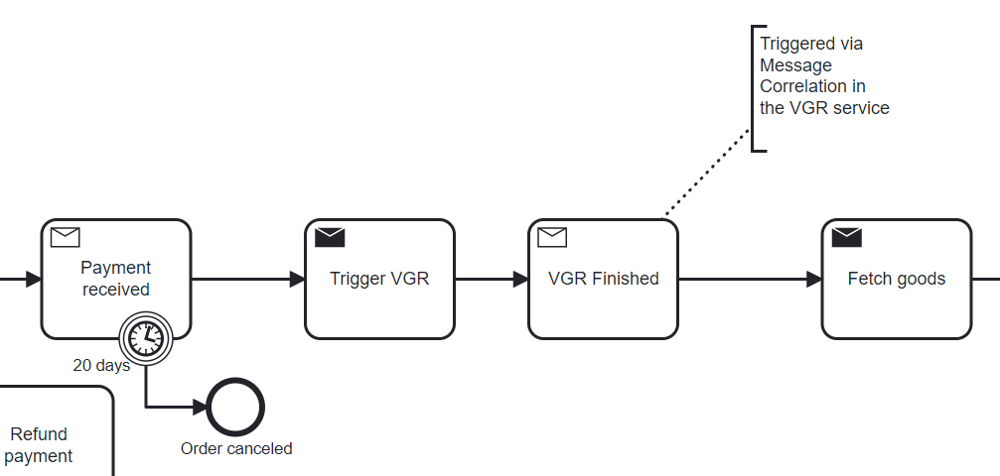
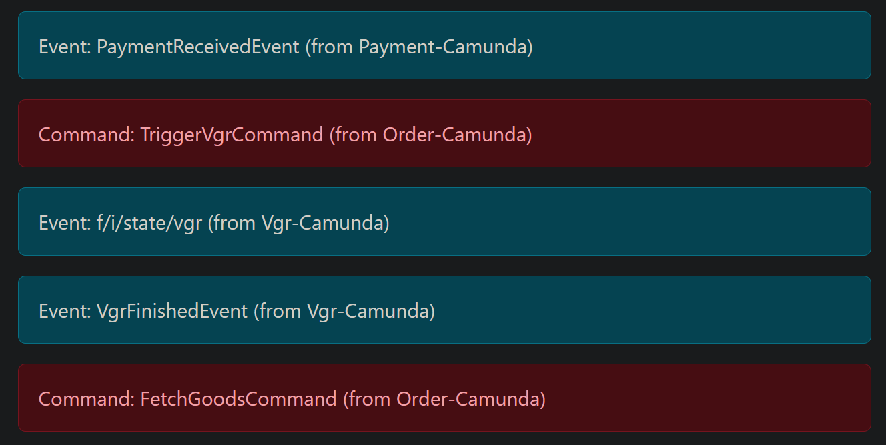

# VGR Service

## Run

The service is integrated with the `flowing-retail Camunda` application. 

In the docker-compose file, the service is defined as a separate service.

```yaml
  vgr:
    build:
      context: ../../kafka/java/vgr-camunda
      dockerfile: Dockerfile
    networks:
      - flowing
    ports:
      - "8097:8097"
    depends_on:
      - kafka
    environment:
      - SPRING_KAFKA_BOOTSTRAP_SERVERS=kafka:9092`
```

It is started when the relevant projects have been built at least once:

```
  $ cd .\kafka\java\
  $ mvn clean install
```

And afterwards you run from the directory [runner/docker-compose](runner/docker-compose).

```
  $ docker-compose -f docker-compose-kafka-java-order-camunda.yml up --build
```

## Implementation

### Resources
[application.properties](src/main/resources/application.properties) contains the configuration for the Kafka server.

```properties
flowing-retail.topic-name=flowing-retail
spring.kafka.bootstrap-servers=kafka:9092
spring.kafka.consumer.auto-offset-reset=earliest
````
[vgr.bpmn](src/main/resources/vgr.bpmn) contains the BPMN model for the VGR service.



### Flow
1. The Order-flow orchestrates the VGR during order fulfillment.



- `Trigger VGR` is implemented as java delegate `#{triggerVgrAdapter}` [TriggerVgrAdapter.java](kafka/java/order-camunda/src/main/java/io/flowing/retail/order/flow/TriggerVgrAdapter.java)
- The execute method invokes sending a message to the `flowing-retail` topic with type `TriggerVgrCommand`.

2. The VGR service listens to the `flowing-retail` topic and processes the `TriggerVgrCommand` message [MessageListener.java](src/main/java/io/flowing/retail/vgr/messages/MessageListener.java)
- The `messageReceived` method reacts to the `TriggerVgrCommand` message constructs a message with the [TriggerVgrCommandPayload](src/main/java/io/flowing/retail/vgr/flow/TriggerVgrCommandPayload.java) and sends it to the `vgr` topic.
- The message is then correlated with the `vgr.bpmn` model which results in the start of a new process instance via `VGR started` start event.

3. The `vgr.bpmn` then starts the `Move Parts` Activity which is implemented as a Java Delegate `#{movePartsAdapter}` [MovePartsAdapter.java](src/main/java/io/flowing/retail/vgr/flow/MovePartsAdapter.java)
- The `execute` method mocks a MQTT message being sent to Kafka from the VGR as obtained from the Smart-Factory Dataset. 
- The idea is to use this as a producer for the data-streams. 
Alternatively, a separate producer could be created which constantly sends messages while the Java-Delegate processes them. 
- The dataset is not yet integrated.
- The message constructed with the [MovePartsEventPayload](src/main/java/io/flowing/retail/vgr/flow/MovePartsEventPayload.java) is sent to the `flowing-retail` topic with type `f/i/state/vgr` which corresponds to the MQTT topic. Once the dataset is integrated, the type should become its own Kafka-topic.
- Currently, the message is not being reacted to.

4. The `vgr.bpmn` then continues with the `VGR finished` end event.
- It's implemented as a Java Delegate `#{vgrFinishedAdapter}` [VgrFinishedAdapter.java](src/main/java/io/flowing/retail/vgr/flow/VgrFinishedAdapter.java) which constructs a message with the [VgrFinishedEventPayload](src/main/java/io/flowing/retail/vgr/flow/VgrFinishedEventPayload.java) and sends it to the `flowing-retail` topic with type `VgrFinishedEvent`.
- The message is then correlated with the `order.bpmn` models incoming-message activity `VGR Finished` which results in the continuation of the order-flow.

### Summary of the Flow


